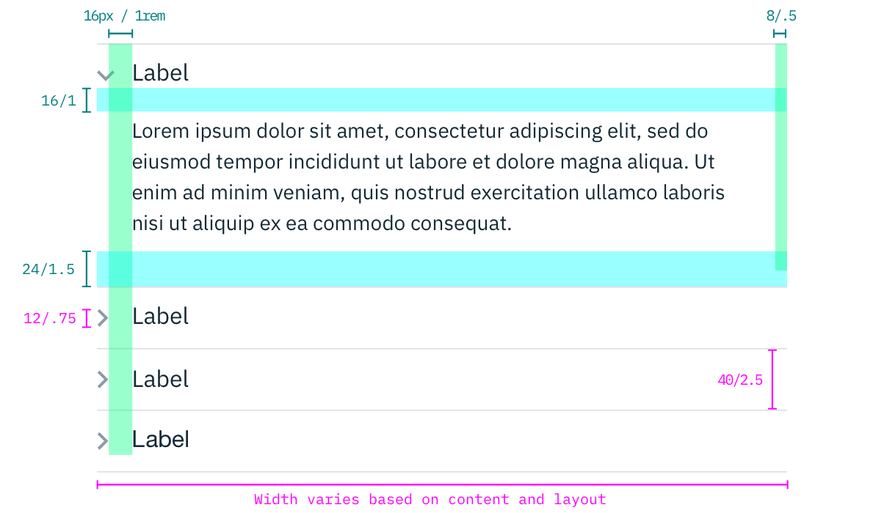

## Color

| ATTRIBUTE          | SCSS       | HEX        |
|----------------|------------|------------|
| Label          | $text-01   |  #152935   |
| Body           | $text-01   |  #152935   |
| Chevron        | $ui-05     |  #8c9ba5   |
| Chevron:hover  | $brand-01  |  #3d70b2   |
| Divider line   | $ui-04     |  #dfe3e6   |

## Typography

All Accordion labels are set in sentence case and should not exceed three words. Set body text appropriately based on content.

| PROPERTY   | FONT-SIZE (px/rem)     | FONT-WEIGHT  |
|------------|-----------------|--------------|
| Label      | 16 / 1     | Normal / 400 |
| Body       | 14 / 0.875 | Normal / 400 |

## Structure

There is no limit to the height of an open row, however, the padding specs below should be followed. The width of an Accordion varies based on the content, layout, and page design. The chevron icon can be found on the [iconography](/style/iconography/library) library page.

| HEIGHT       | PX | REM   |
|--------------|----|-------|
| Row          | 40 | 2.5   |
| Chevron      | 10 | 0.635 |
| Divider line | 1  | -     |

### Spacing

Avoid having any text within 16px / 1rem of the Accordion's sides. Additionally, include padding between labels, body copy, and separation lines to provide breathing room between elements.

| SPACING              | PX | REM |
|----------------------|----|-----|
| Chevron & label      | 16 | 1   |
| Content & right edge | 8  | 0.5 |
| Label & content      | 16 | 1   |
| Content & line       | 24 | 1.5 |

_Structure and spacing measurements for Accordion | px / rem_
