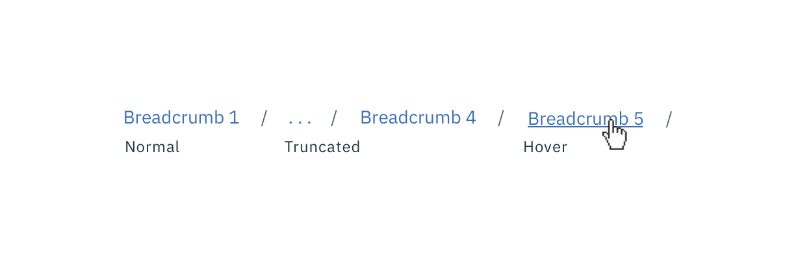
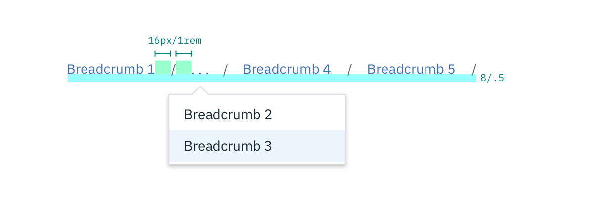

## Color

| Class                         | SCSS      | HEX      |
|-------------------------------|----------|-----------|
| `bx--link`                    | $brand-01| #3d70b2   |
| `.bx--breadcrumb-item::after` | $text-02 | #5a6872  |
| Overflow text  | $text-01  | #152934   |
| Row:hover | $hover-row | #5596e6 at 10% opacity |
| `.bx--link:hover`             | $hover-primary-text | #294c86   |

## Typography

When a user hovers overs a Breadcrumb, the Breadcrumb title should be underlined.

| Class         | Font-size    | Font-weight  |
|---------------|--------------|--------------|
| `bx--link`    | 14 / 0.875   | Roman / 400  |
| Dropdown text | 14 / 0.875 | Roman / 400  |

_Breadcrumb typography treatment example_

## Structure

The on-click dropdown should follow the [Overflow Menu](/components/overflow-menu) specs for sizing, padding, and interaction.

| Class                        | Property   | px | rem |
|------------------------------|------------|----|----|
| `.bx--breadcrumb-item::after`| margin-left| 16 | 1   |
| Icon & dropdown | 8  | 0.5 |

_Structure and spacing measurements for Breadcrumb | px / rem_
