## Color

| Attribute                   | SCSS                   | HEX                    |
|-----------------------------|------------------------|-----------------------|
| `bx--btn--primary` `bx--btn--secondary` | $brand-01  | #3d70b2               |
| `bx--btn--primary:hover`     | $hover-primary        | #30588c               |
| `bx--btn--primary:disabled`  | $brand-01             | #3d70b2 at 50% opacity|
| `bx--btn--secondary:hover`   | $hover-secondary      | #3d70b2               |
| `bx--btn--tertiary`          | $ui-05                | #5a6872               |
| `bx--btn--tertiary:hover`    | $ui-05                | #5a6872               |
| `bx--btn--danger--primary` `bx--btn--danger--secondary` |$support-01                   | #e0182d               |
| `bx--btn--danger--primary:hover` | $hover-danger     | #bd1427               
| `bx--btn--danger--secondary:hover` | $support-01     | #e0182d               |

  

    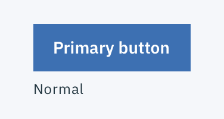
  

  

    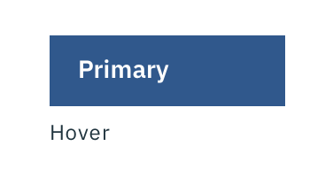
  

  

    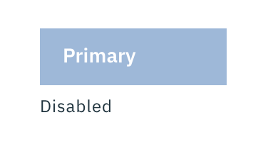
  

  

    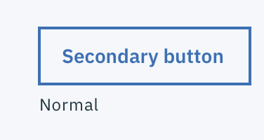
  

  

    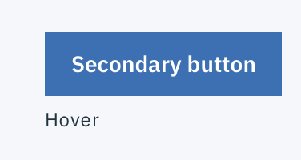
  

  

    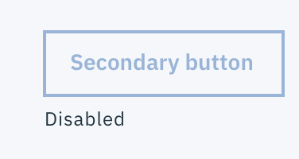
  

  

    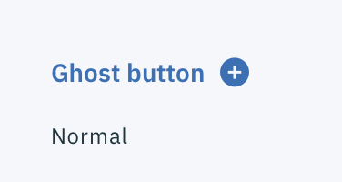
  

  

    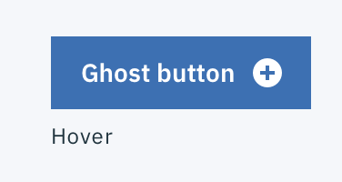
  

  

    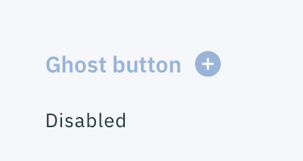
  

_Primary, Secondary, and Ghost Button state examples_

## Typography

Button text should be set in sentence case, with only the first word in a phrase and any proper nouns capitalized.

| Property       | Font-size (px/rem) | Font-weight     |
|----------------|--------------------|-----------------|
|`bx--btn`       | 14 / 0.875         | Semi-Bold / 600 |

## Structure

| Height                     | px | rem |
|----------------------------|----|-----|
| `bx--btn--primary` | 40 | 2.5 |
| `bx--btn--sm`   | 32 | 2   |

  

    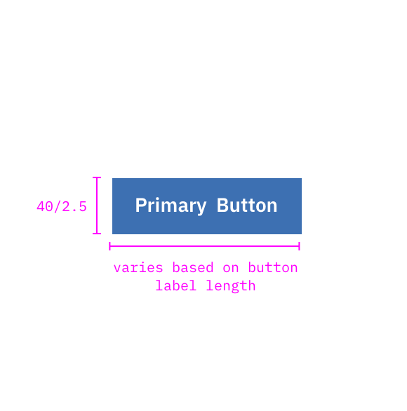
  

  

    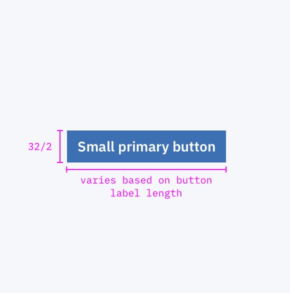
  

_Stucture measurements for small and regular Primary Button | px / rem_

### Spacing

A Button cannot have any element or text within 16 pixels / 1 rem of its borders. For Button groups, the primary button is positioned on the outside of the set, while the secondary button is positioned inside. For a Button with a glyph, the space between the button label and the glyph must be greater than or equal to 16 pixels / 1 rem. This is to accommodate for instances where two or more buttons with glyphs appear together.

| Spacing                   | Property | px | rem  |
|---------------------------|----------|----|------|
| `bx--btn`                 | padding-left, padding-right | 16 | 1     |
| `bx--btn--sm`             | padding-left, padding-right |16 | 1     |
| `.bx--btn .bx--btn__icon` | margin-left | 8 | 0.5     |
| `.bx--btn--ghost .bx--btn__icon`| margin-left | 8 | 0.5     |
| External: button          | 10 | 0.625 |
| Button pairings           | 16 | 1     |

  

    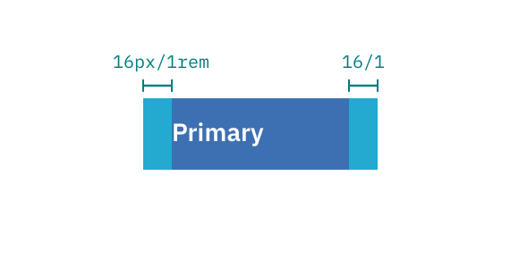
  

  

    
  

  

    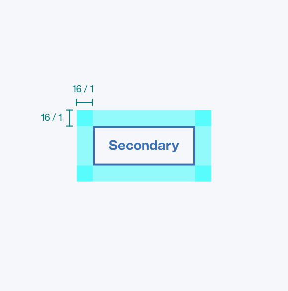
  

  

    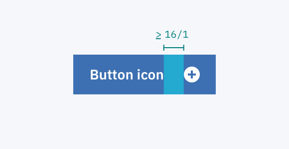
  

  

  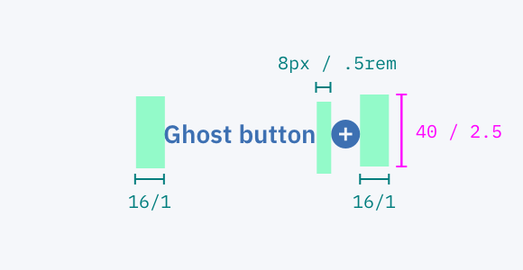
  

  

  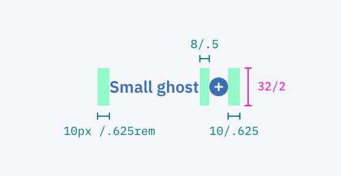
  

_Spacing measurements for various Button types | px / rem_
