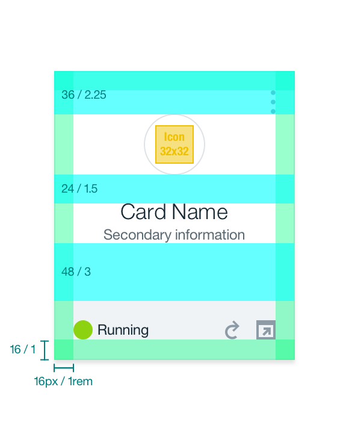

## Color

| ATTRIBUTE             | SCSS     | HEX      |
|-------------------|----------|----------|
| Background        | $ui-01   | #ffffff  |
| Footer background | $ui-03   | #f0f3f6  |
| Border            | $ui-04   | #dfe3e6  |
| Text              | $text-01 | #152935  |
| App actions icon  | $ui-05   | #8c9ba5  |

## Typography

Card names and card information should be set in title case with the first letter of each word capitalized. All other text should be set in sentence case.

| PROPERTY                  | FONT-SIZE (px/rem)    | FONT-WEIGHT  |
|----------------------------|-----------------|--------------|
| Card name                  | 18 / 1.125 | Light / 300  |
| Secondary info             | 12 / 0.75  | Normal / 400 |
| Status                     | 12 / 0.75  | Normal / 400 |

## Layer

| LAYER    | ELEVATION | BOX-SHADOW  |
|----------|---------- |-------------|
| Raised   | 2         | `0 1px 2px 0 rgba(0,0,0,0.10);` |

## Structure

There are several types of cards, each having its own measurements and attributes. Please select the appropriate card based on content and card needs. Find the measurement and visual details for each card type listed below. Card icons can be found in the [iconography](/style/iconography) page.

| PROPERTY             | PX  | REM    |
|----------------------|-----|--------|
| Height               | 240 | 15     |
| Width                | 200 | 12.5   |
| Footer               | 48  | 3      |
| Icon circle          | 50  | 3.125  |
| Icon                 | 32  | 2      |
| Border               | 1   | -      |

---
***
> 

_Structure measurements for a Card | px / rem_

| SPACING                  | PX | REM   |
|--------------------------|----|-------|
| Internal                 | 16 | 1     |
| Card top to icon         | 36 | 2.25  |
| Icon to card name        | 24 | 1.5   |
| Secondary Info to Footer | 48 | 3     |

---
***
> 

_Spacing measurements for a Card | px / rem_
