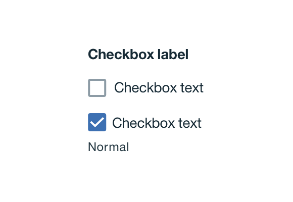
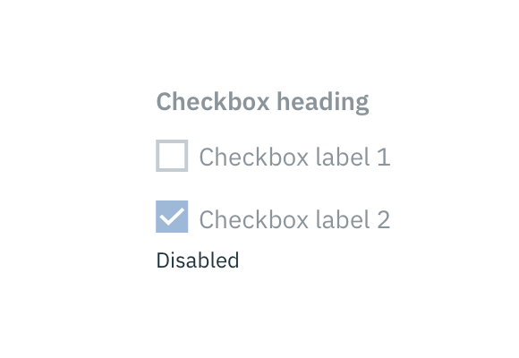
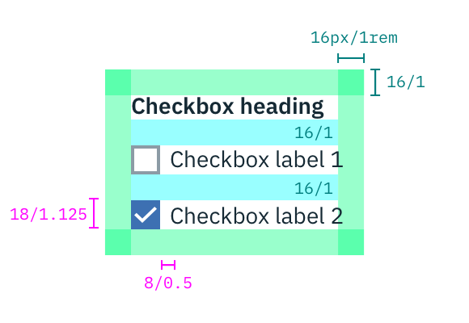

## Color

| ATTRIBUTE             | SCSS        | HEX         |
|-------------------|-------------|-------------|
| Checked: fill     | $brand-01  | #3d70b2     |
| Unchecked: border | $ui-05     | #8c9ba5     |
| Unchecked: fill   | $ui-01     | #ffffff     |
| Icon: checkmark   | $inverse-01 | #ffffff     |
| Text              | $text-01    | #152935     |

  

    
  

  

    
  

_Disabled and normal Checkbox states_

## Typography

Checkbox headings and labels should be sentence case, with only the first word in a phrase and any proper nouns capitalized. Checkbox headings and labels should not exceed three words.

| PROPERTY   | FONT-SIZE (px/rem)     | FONT-WEIGHT  |
|------------|-----------------|--------------|
| Heading    | 14 / 0.875 | Bold / 700   |
| Label      | 14 / 0.875 | Normal / 400 |

## Structure

| PROPERTY             | PX | REM  |
|----------------------|----|------|
| Height & width       | 18 | 2.75 |
| Outline              | 2  | -    |
| Spacing: checkboxes  | 16 | 1    |
| Spacing: checkbox & label | 8  | 0.5  |
| External Spacing     | 16 | 1    |

---
***
> 

_Structure and spacing measurements for Checkbox | px / rem_
