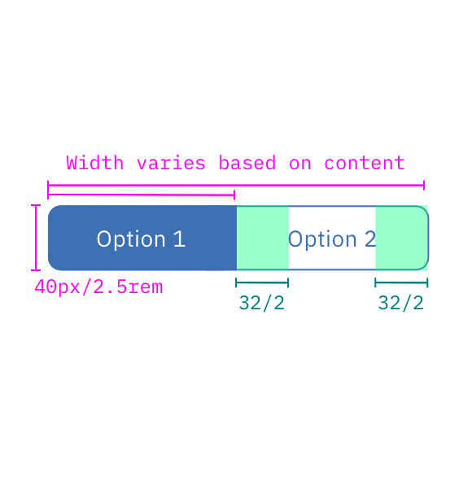

## Color

| ATTRIBUTE              | SCSS | HEX |
|--------------------|------|------|
| Active: fill       | $brand-01   | #3d70b2  |
| Active: text       | $inverse-01 | #ffffff  |
| Inactive: border   | $brand-01   | #3d70b2  |
| Inactive: text     | $brand-01   | #3d70b2  |
| :hover             | $brand-02   | #5596e6  |

## Typography

Content Switcher text should be set in sentence case, with only the first word in a phrase and any proper nouns capitalized. The text should not exceed three words.

| PROPERTY   | FONT-SIZE (px/rem)      | FONT-WEIGHT  |
|------------|-----------------|--------------|
| Text       | 14 / 0.875 | Normal / 400 |

## Structure

Content Switchers must have at least two options for the user to choose from. Each container that makes up the Content Switcher is equal in size. The width of a container is determined by the length of the longest container option text plus the 32 px / 2rem on both sides of the text.

| PROPERTY         | PX | REM |
|------------------|----|-----|
| Height           | 40 | 2.5 |
| Border           | 1  | -   |
| Internal spacing | 32 | 2   |

---
***
> 

_Structure and spacing measurements for Content Switcher | px / rem_

### States

Content Switchers have two states: selected and non-selected. Selected states are a solid color. There must always be only one selected state, no more, no less. Unselected options have a 1px border with no fill.
