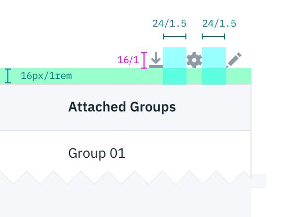

## Color

| Attribute                       | SCSS     | HEX       |
|-----------------------------|--------- |-----------|
| Background: light           | $ui-01   | #ffffff   |
| Background: gray            | $ui-02   | #f4f7fb  |
| Table header                | $ui-02   |  #f4f7fb  |
| Table border                | $ui-04   |  #8897a2  |
| Row:hover                   | $hover-row | #5596e6 at 10% opacity   |
| Zebra stripe                | $ui-02   | #f4f7fb   |
| Expanded: border-left       | $brand-01| #3d70b2   |
| Text                        | $text-01 | #152935   |
| Chevron, caret, overflow menu icon             | $ui-05   | #5a6872   |

### Style options
Specific styling on the Data Table component can be toggled on/off based on user or team preference.

**Row dividers, Zebra striping, & table border**

If zebra striping is turned off, you must have Row dividers.

_Data Table with various row styling_

 

**Background colors**

Data Tables are built to be accessible against two `$ui-01` and `$ui-02`:

_Data Table on ui-01 vs ui-02_

## Typography
Column headers should be in title case. All other table text should be sentenced case.

| Class                      | Font-size (px/rem)| Font-weight    |
|----------------------------|-------------------|----------------|
| `bx--data-table-v2-header` | 18 / 1.125        | Semibold / 600 |
| `bx--table-header-label`   | 14 / 0.875        | Semibold / 600 |
| Text                       | 14 / 0.875  | Normal / 400 |

## Structure
Tables are a configurable and customizable component. Designers can pick and choose certain elements and interactions.

### Row sizes
Short and Default are offered as **user preferences** that can be accessed from the table settings menu.

Compact and Tall are designer and developer preferences. Tall row heights are only recommended if your data is expected to have 2 lines of content in a single row.

|Class                        | Size     | Row Height (px/rem) |
|-----------------------------|----------| --------------------|
|`.bx--data-table-v2--compact`| Compact  |  24 / 1.5           |
|`.bx--data-table-v2--short`  | Short    |  32 / 2             |
|`.bx--data-table-v2 tr`      | Default  |  48 / 3             |
|`.bx--data-table-v2--tall`   | Tall     |  64 / 4             |

_Data Table: varying row sizes_

### Simple Data Table
The basic table style is the required base from which tables can be developed. Basic tables are composed of a header row followed by rows of data below. At a minimum, tables require three or more columns.

Column widths can vary by content and only requires a minimum spacing between columns.

| Property                | px | rem  |
|-------------------------|----|------|
| Height: header          | 48 | 3    |
| Width                   | Varies based on content and layout | |
| Chevron                 | 12   | 0.75  |
| Checkbox                | 18   | 1.125 |

### Data table
After the simple table structure, tables can be enhanced by adding any of the following: selectable rows, expanding rows, nested tables, row menus, table batch actions, overall table menu, and/or table filter.

|| Spacing            | px   | rem   |
||--------------------|------|-------|
||`.bx--data-table-v2-header`     | 16   | 1     |
|| Header & caret     |  8   | 0.5   |
|| Basic internal     | 24   | 1.5   |
|| Enhanced internal  | 16   | 1     |
|| Internal elements  | 16   | 1     |
|| Between columns    | ≥ 24 | 1.5   |

  

_Structure and spacing measurements for a basic and an enhanced Data Table | px / rem_

### Toolbar

| Property               | px   | rem   |
|------------------------|------|-------|
| Icon height            | 16   | 1   |
| Spacing: icons         | 24   | 1.5 |
| Spacing: icons & table | 16   | 1   |

<!-- Note: broken down by individual icons -->

---
***
> 

_Structure and spacing measurements for toolbar icons | px / rem_
