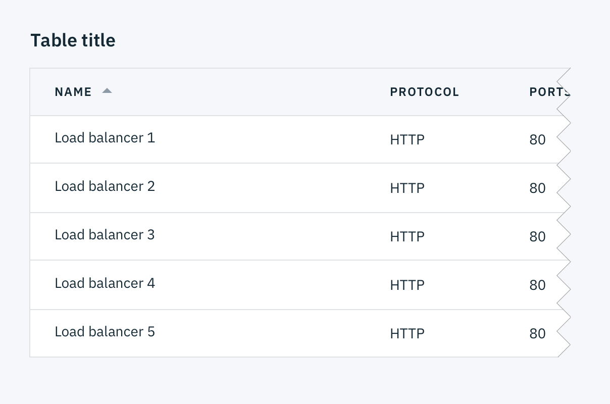
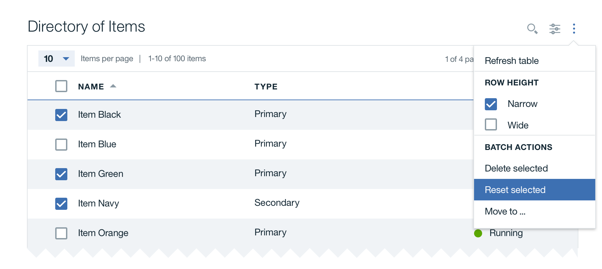
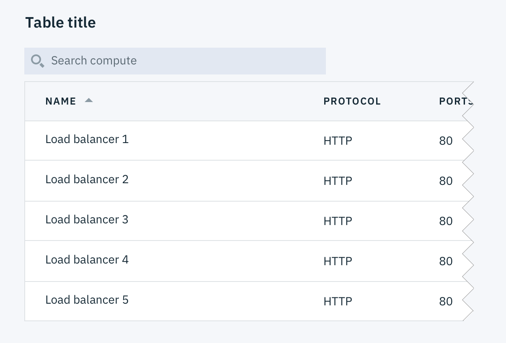
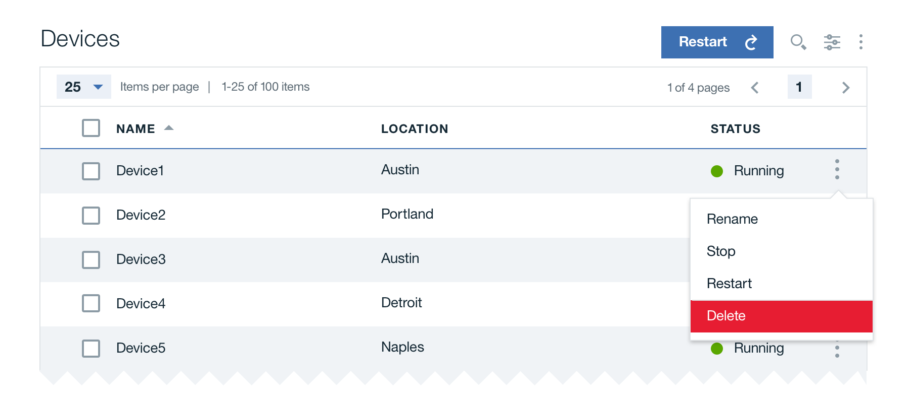
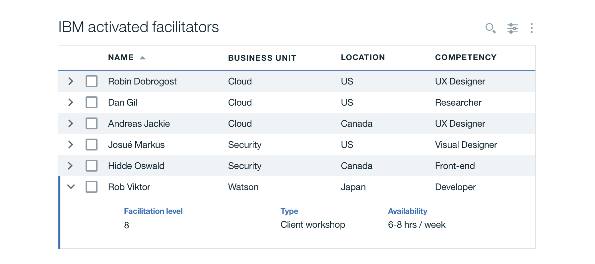
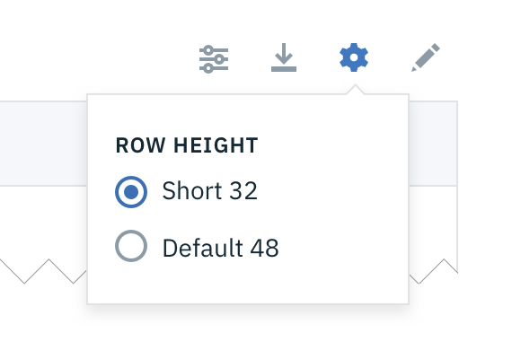

## Format

### Header row

Use meaningful text to label the table data and provide clarity to the content below.

### Number of columns

For large sets of data, it is preferable to use rows instead of columns in order to guide the eye across the page. It is quicker and easier to scan down a single row rather than scan across multiple columns of related data.

### Zebra stripes

Alternate colors on rows to increase readability. This also helps to guide the user through data in a table.

## Interactions

### Search

Search functionality within a table follows [Small search](/components/search) conventions.

### Sorting

Improve table usability by making data sortable. Clickable headers enable users to sort table data up or down. The specific attribute being sorted is accompanied by a caret icon.

### Batch actions

Batch actions are functions that may be performed on multiple items within a table. Use an [Overflow Menu](/components/overflow-menu) to present batch actions to the user. The Overflow Menu appears when the user clicks on the icon. If there is only one batch action available for the table data, that action should be styled as a [Small Button](/components/button) and live outside of the Overflow menu.

_Batch actions in Overflow Menu_

_One batch action as Small Button_

### Inline actions

Inline actions are functions that may be performed on a specific table item. Each row is accompanied by an [Overflow Menu](/components/overflow-menu) that contains actions related specifically to that table row.

### Expandable rows

Expandable rows show minimal information at a high-level and a more detailed view nested within that row.

## Additional content

Depending on the type of data within a table, any of the options below may be used to load additional content. It is important to note that only one of these solutions should be implemented.

### Pagination

Pagination divides table data into separate pages. Pagination is accompanied by an option that enables the user to change the number of items per page. See the [Pagination](/components/pagination) component for further guidelines.

### Lazy load

Lazy loading loads additional content as users scroll in their viewport.

### Empty state

Inform the user in the case where there is no data to be displayed.

