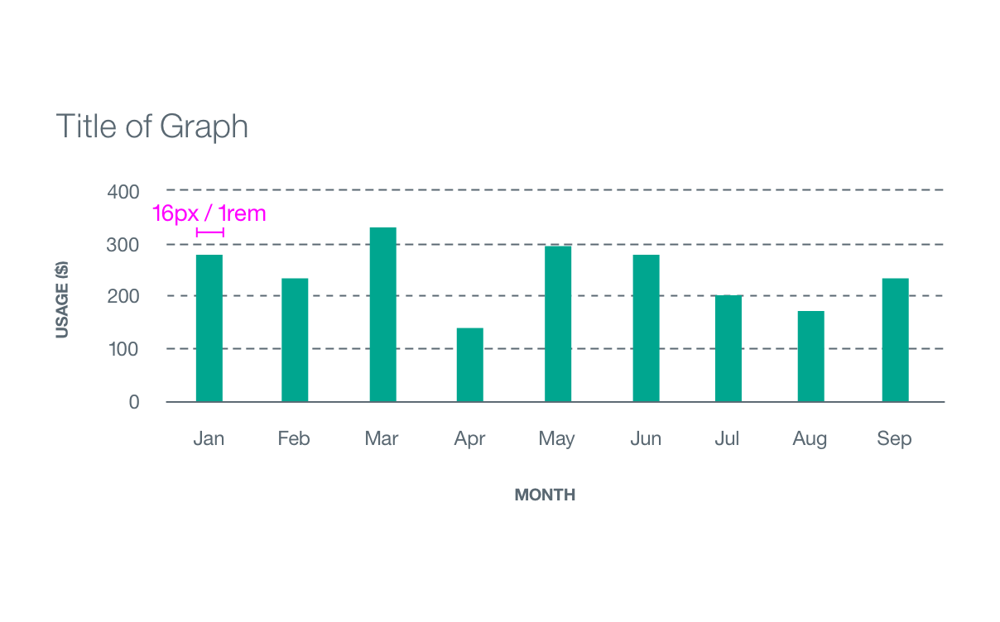
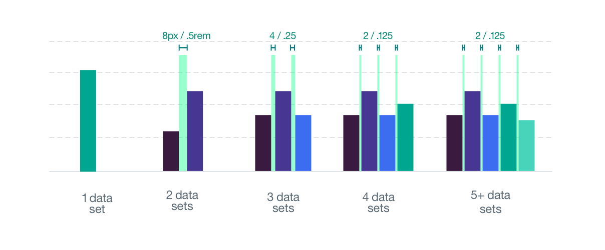

Refer to the style tab on the [Data Vis overview page](/data-vis/overview/style) for base graph style specifications.

## Structure
The height of a bar varies based off of the value for that data increment.

| PROPERTY             | PX | REM |
|----------------------|----|-----|
| Bar width   			   | 16 |  1  |

_Spacing examples for a Bar Graph | px / rem_

| SPACING                   | PX | REM  |
|---------------------------|----|------|
| 2 data sets               | 8  | .5   |
| 3 data sets               | 4  | .25  |
| 4 data sets               | 2  | .125 |
| 5+ data sets              | 2  | .125 |

_Spacing examples for a Bar Graph | px / rem_
