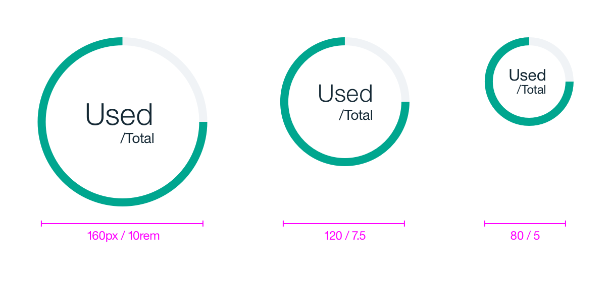

## Color

| COLOR            | SCSS                   | HEX                 |
|------------------|------------------------|---------------------|
| Total            | $ui-03                 | #f0f3f6             |
| Used             | $primary-04            | #00a68f             |

## Typography
Please note the total number should be left aligned with the used number.

| PROPERTY            | FONT-SIZE (PX/REM)       | FONT-WEIGHT  |
|---------------------|------------------|--------------|
| Small gauge: used   | 16 / 1     | Roman / 400  |
| Small gauge: total  | 12 / 0.75   | Roman / 400  |
| Medium gauge: used  | 24 / 1.5    | Light / 300  |
| Medium gauge: total | 14 / 0.875  | Roman / 400  |
| Large gauge: used   | 30 / 1.5    | Light / 300  |
| Large gauge: total  | 14 / 0.875  | Roman / 400  |

## Structure
| PROPERTY              | PX  | REM |
|-----------------------|-----|-----|
| Small gauge           | 80  | 5   |
| Medium gauge          | 120 | 7.5 |
| Large gauge           | 160 | 10  |
| Gauge weight          | 8   | 0.5 |

_Structure for Circle Chart | px / rem_
