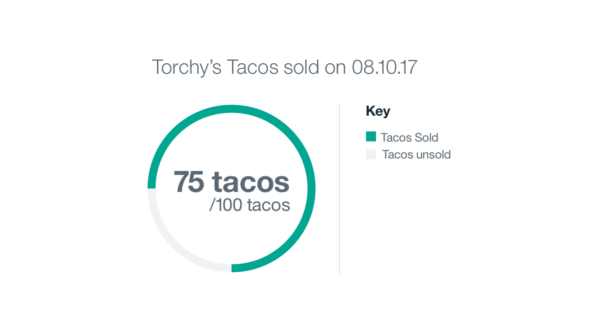

## General Guidelines

Gauge graphs show individual values that make up a whole data set so users can compare the values to each other and see how each value compares to the whole. A common way to express the part-to-whole relationship is to use percentages, with the whole equaling 100% and each of its parts equaling smaller percentages corresponding to its value relative to the whole.

_Example of a Circle Gauge_
