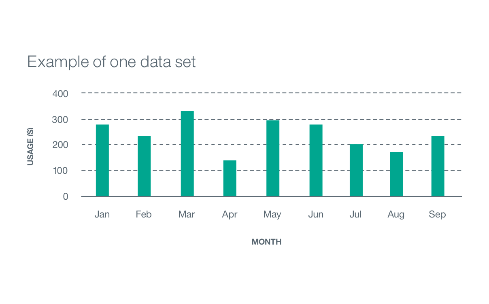
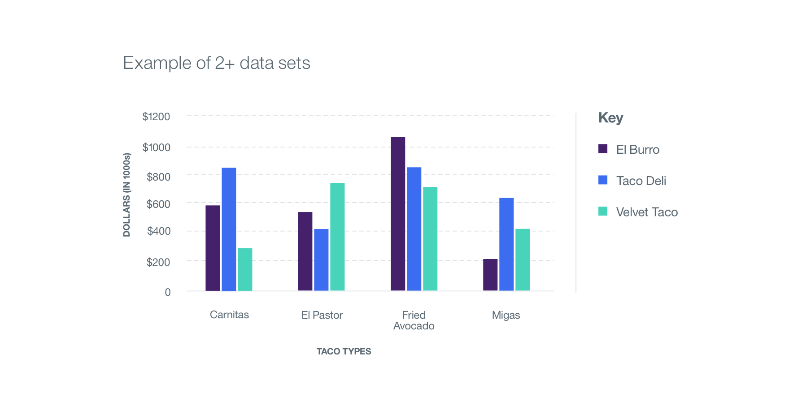
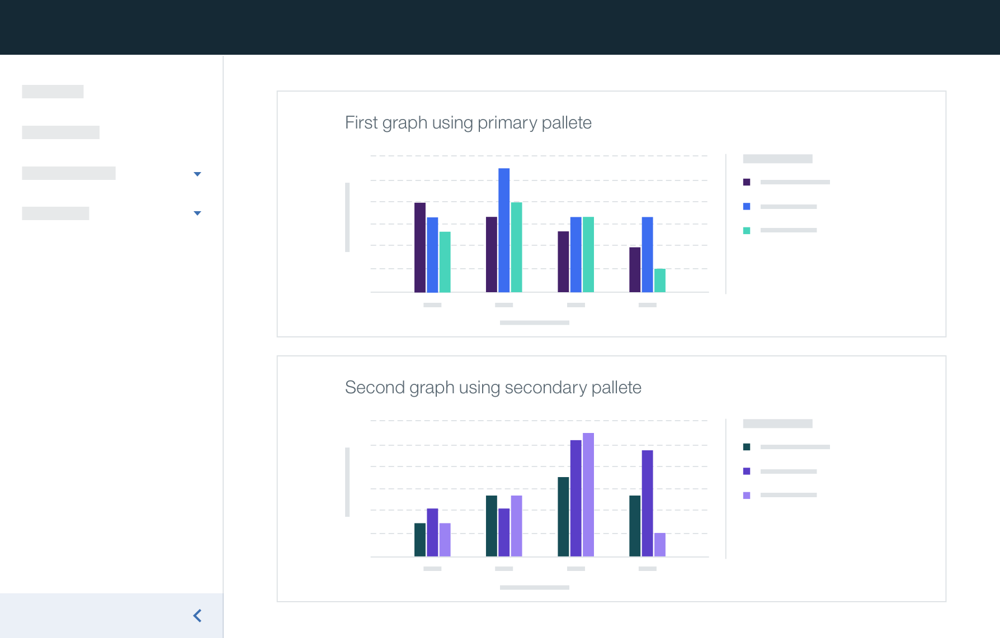

## Color usage best practices

Apply the primary data vis color `primary-04` when using only one data set. If you are comparing multiple sets of data, start by using colors in the primary theme so that each data set is assigned its own color. The primary theme is always used for the first data visualization on any given page. If there is more than one data visualization on a page, the secondary and/or tertiary themes may be used.

If you have multiple graphs on a page where your first graph is only using the primary data vis color (primary-04) and your second graph requires multiple colors, use the remaining colors from the primary theme before using another palette.

For data visualizations with touching colors (no white space between blocks of color representing data), make sure to use the colors in the order they are shown from left to right (dark to light). For example, if you are comparing three sets of data, the colors `primary-01`, `primary-02`, and `primary-03` are used in that order, respectively.

| DATA SET/GRAPH           | THEME/COLOR     |
|--------------------------|-----------------|
| One data set             | primary-04      |
| Two+ data sets           | primary theme   |
| Two+ data visualizations | primary theme, secondary theme, and/or tertiary theme |

### One data set

_Example of primary-04 applied to one data set_

### Two or more data sets

_Example of primary theme applied to two+ data sets_

### Two or more data visualizations on one page

_Example of two themes applied to two data visualizations_
