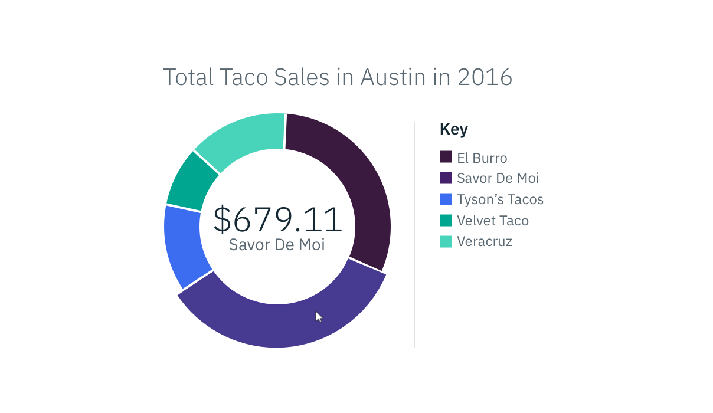
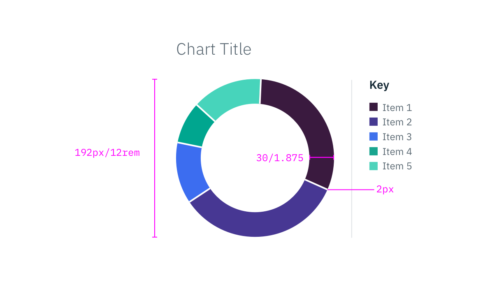

## Color

Refer to the style tab on the [Data Vis overview page](/data-vis/overview/style) for base graph style specifications.

| ATTRIBUTE                       | SCSS     | HEX     |
|---------------------------------|----------|---------|
| Data Value	                    | $text-01 | #152935 |
| Data Variable	                  | $text-02 | #5A6872 |

_Example of a Pie Chart section, hovered_

## Typography

| PROPERTY                       | FONT-SIZE (PX/REM) | FONT-WEIGHT   |
|--------------------------------|--------------------|---------------|
| Data Value	                   | 29/1.8125          | Light / 300   |
| Data Variable	                 | 14/0.875           | Normal / 400  |

## Structure

| PROPERTY                       | PX   | REM   |
|--------------------------------|------|-------|
| Height & width			           | 192  | 12    |
| Chart Thickness                | 30   | 1.875 |
| Spacing: data representations  | 2    | -     |

_Example of a Pie Chart | px/rem_
