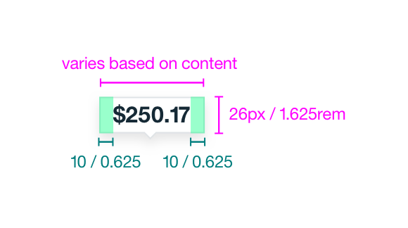
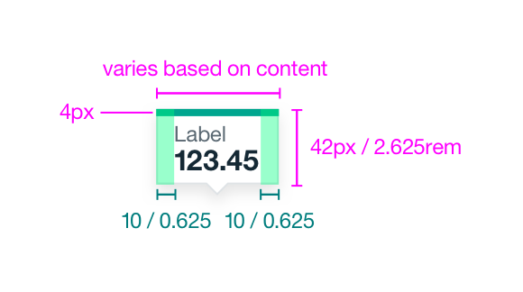
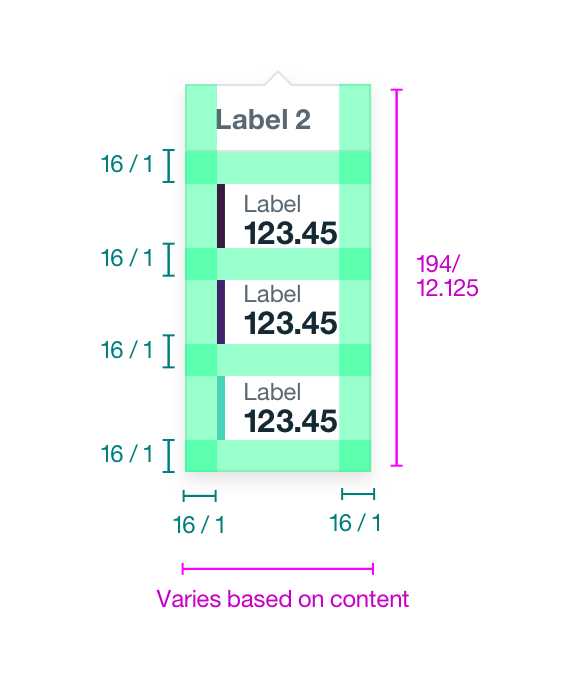
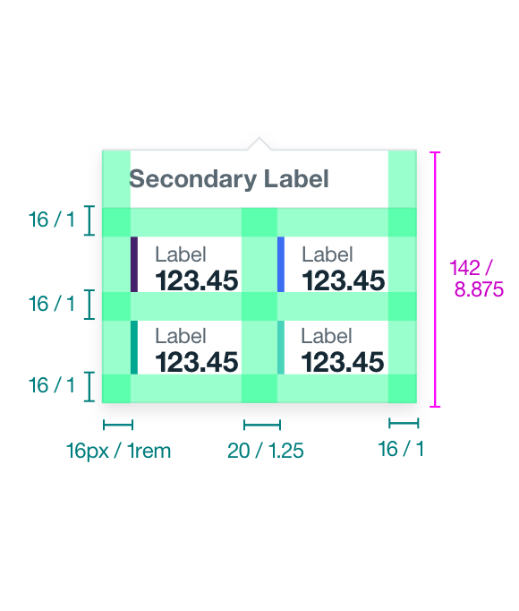
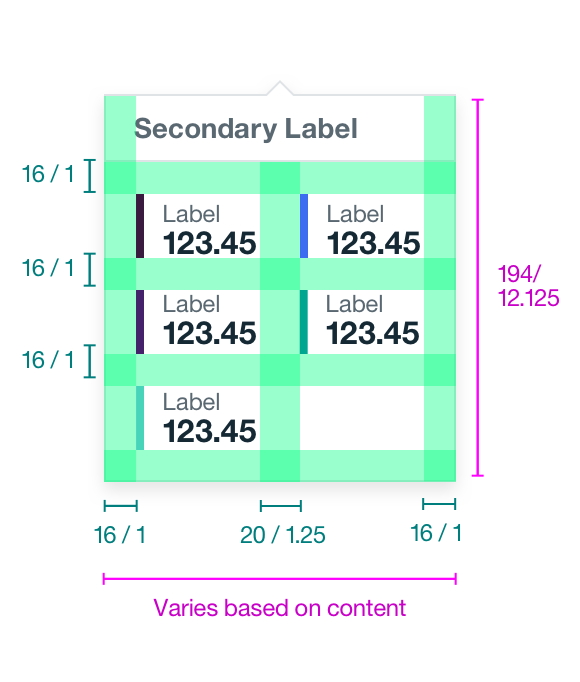
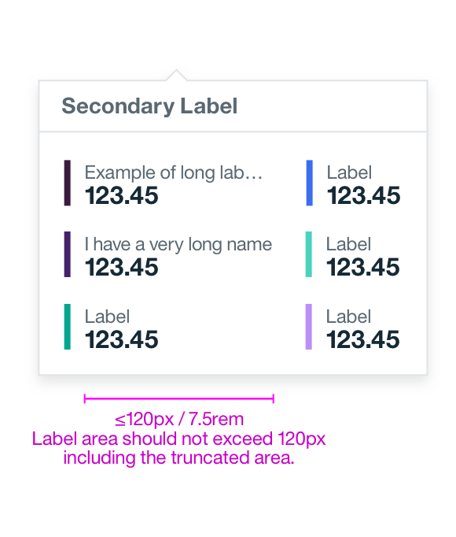
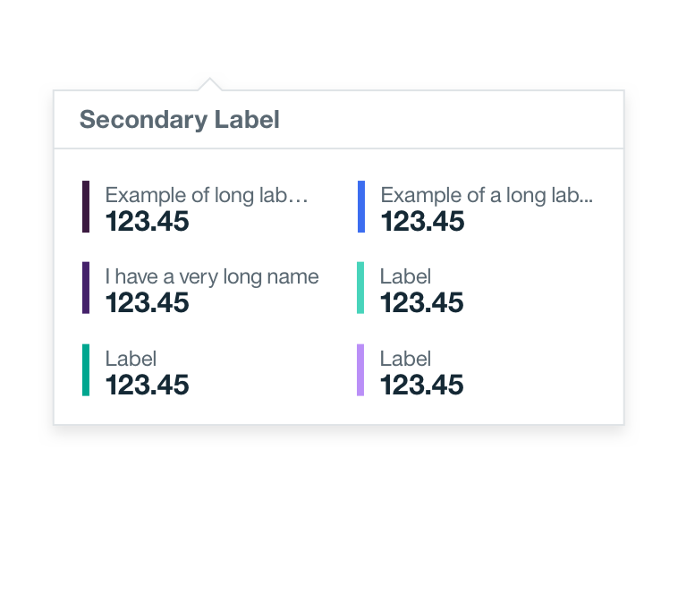

## Color
Note that the color value of top bar of the ___ tooltip and the side color bars on multi-data value tooltip vary based on colors chosen for your data. Refer to the style tab on the [Data Vis overview page](/data-vis/overview/colors) for base graph style specifications.

| COLOR            | SCSS                   | HEX        |
|------------------|------------------------|------------|
| Background       | $ui-01                 | #FFFFFF    |
| Border           | $ui-04                 | #DFE3E6    |
| Quantitative data value label | $text-01  | #152934    |
| Additional data value label (qualitative) | $text-02  | #5A6872   |
| Data increment label  | $text-02  | #5A6872  |

## Typography
| PROPERTY         | FONT-SIZE (PX/REM) |  FONT-WEIGHT |
|------------------|--------------------|--------------|
| Quantitative data value label | 16/1  | Bold / 700   |
| Additional data value label (qualitative) | 12/0.75   | Roman / 400   |
| Data increment label  | 14/0.875      | Bold / 700   |

## Layer
| LAYER      | ELEVATION  | BOX-SHADOW                       |
|------------|------------|----------------------------------|
| Overlay    | 8          | `0 4px 8px 0 rgba(0,0,0,0.10);`  |

## Structure
There are three different tooltips types. Refer to the [usage tab](/data-vis/tooltip/usage) for when to use which tooltip size.

### Small Tooltip
Width varies based on content length.

| SIZE                | PX    |  REM   |
|---------------------|-------|--------|
| Height				  |  26   | 1.625  |
| Padding: Internal   |  10   | 0.625  |

**

**
_Example of a small Tooltip_

### Medium Tooltip
Width varies based on content length.

| SIZE                | PX    |  REM   |
|---------------------|-------|--------|
| Height				  |  42   | 2.625  |
| Padding: internal   |  10   | 0.625  |  
| Color bar           |  4    | -      |
| Maximum label width |  120  | 7.5    |  

**

**
_Example of a medium Tooltip_

### Large Tooltip
Width varies based on content length.

| SIZE                | PX    |  REM   |
|---------------------|-------|--------|
| Height				  | 188   | 11.75  |
| Padding: internal   |  16   | 1      |  
| Padding: data sets (vertically) |  20    | 1.25  |
| Padding: data sets (horizontally)  |  16   | 1   |
| Padding: color bar & data labels   |  10   | 0.625 |
| Color bar      | 4     | -      |
| Maximum label width |  120  | 7.5    |  

**

**
_Example of a large Tooltip_

## Tooltip responsiveness
The below images show how a tooltip would respond to different amounts of data values. It also shows how the width of tooltip changes when a label is at its max-width.

**

**
_Examples of tooltip responsiveness for different data value amounts_

**

**
_Example of max-width labels, one column, and two-column_
