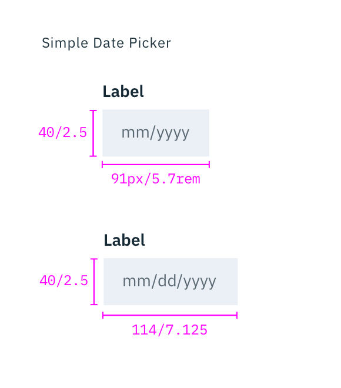
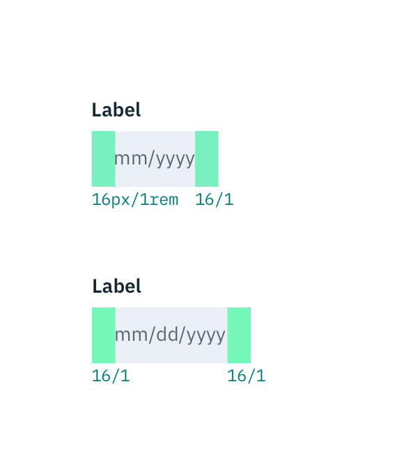
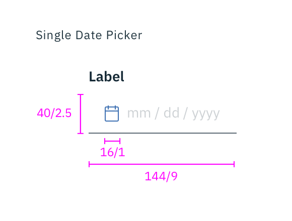
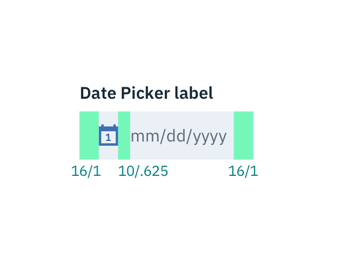
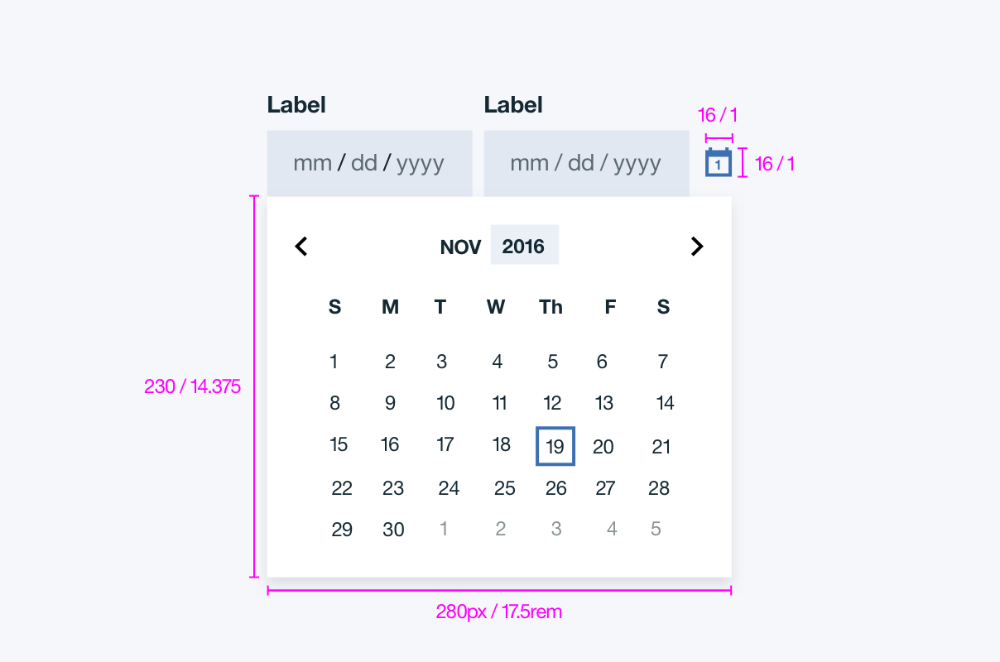
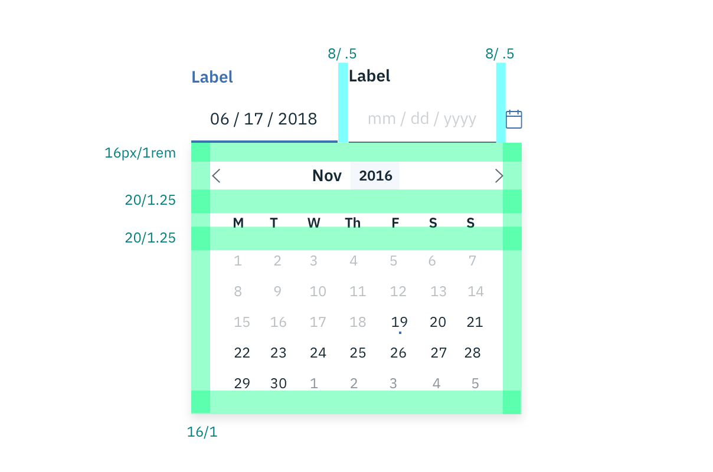
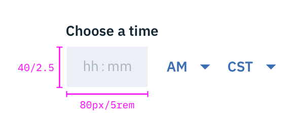
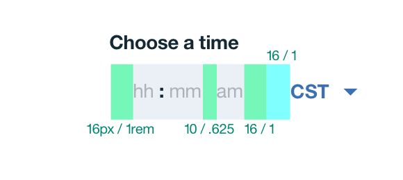

## Color
If a `min date` is set on the calendar, then any text appearing before that date will be `#152934 @ 50%`, otherwise all text should be `#152934` (unless the number is selected or highlighted). Please refer to [Select](/components/select), for inline select styling.

| COLOR                    | SCSS       | HEX       |
|--------------------------|------------|-----------|
| Label                    | $text-01   | #152934   |
| Text: placeholder        | $text-02   | #5a6872   |
| Text: selected date      | $ui-01     | #ffffff   |
| Text: user input         | $text-01   | #152934   |
| Text: Highlighted date range text  | $text-01   | #5596e6   |
| Background: Text Input   | $field-01  | #3d70b2 @ 10%|
| Background: calendar widget | $ui-01     | #ffffff   |
| Background: selected date| $brand-01  | #3d70b2   |
| Background: highlighted date range       | $brand-02  | #5596e6   |
| Icon                     | $brand-01  | #3d70b2   |
| Border: current date     | $brand-01  | #3d70b2   |

_Structure for Date Picker | px / rem_

## Typography
Labels should be set in sentence case, with only the first word in a phrase and any proper nouns capitalized, and no more than three words.

| Property         | Font-size       | Font-weight  |
|------------------|-----------------|--------------|
| Label            | 14 / 0.875      | Bold / 700   |
| Text: user input  | 14 / 0.875      | Roman / 400  |
| Text: month & year | 12 / 0.75     | Bold / 700   |
| Text: day of the week | 12 / 0.75  | Bold / 700   |
| Text: day        | 12 / 0.75       | Roman / 400  |

## Layer
| COMPONENT                     | LAYER    |
|-------------------------------|----------|
| Calendar widget               | Overlay  |

## Structure

### Simple & Single Date Pickers

| PROPERTY                     | PX  | REM    |
|------------------------------|-----|--------|
| Height                       | 40  | 2.5    |
| Width: Simple Date Picker (mm/yyyy) | 91 | 5.7   |
| Width: Simple Date Picker (mm/dd/yyyy) | 114 | 7.125  |
| Width: Single Date Picker    | 144 | 9      |
| Calendar icon                | 16  | 1      |
| Internal spacing             | 16  | 1      |
| Spacing: icon & input text   | 10  | 0.625|

  

    
  

  

    
  

  

    
  

  

    
  

_Structure and spacing for Simple & Single Date Pickers | px / rem_

### Range Date Picker

| PROPERTY                     | PX  | REM    |
|------------------------------|-----|--------|
| Height                       | 230 | 14.375 |
| Width                        | 280 | 17.5   |
| Calendar icon                | 16  | 1      |
| Spacing: right of text input | 8   | 0.5    |
| Internal spacing             | 16  | 1      |
| Spacing: month & days of week| 20  | 1.25   |
| Spacing: days of week & days | 20  | 1.25   |
| Current date border          | 2   | -      |

_Structure for Date Picker | px / rem_

_Spacing for Date Picker | px / rem_

### Time Picker
There are two types of time pickers; a 12-hour and 24-hour time picker. The 12-hour Time Picker is accompanied by a time period (am/pm) input, while the 24-hour clock is not.

| PROPERTY                     | PX  | REM   |
|------------------------------|-----|-------|
| Height                       | 40  | 2.5   |
| Width: 12-hour clock         | 112 | 7     |
| Width: 24-hour clock         | 80  | 5     |
| Internal spacing             | 16  | 1     |
| Spacing: time & period       | 10  | 0.625  |
| Spacing: time picker & inline select | 16  | 1  |

  

    
  

  

    
  

  

    
  

  

    
  

_Structure and spacing for 12-hour and 24-hour Time Pickers | px / rem_
