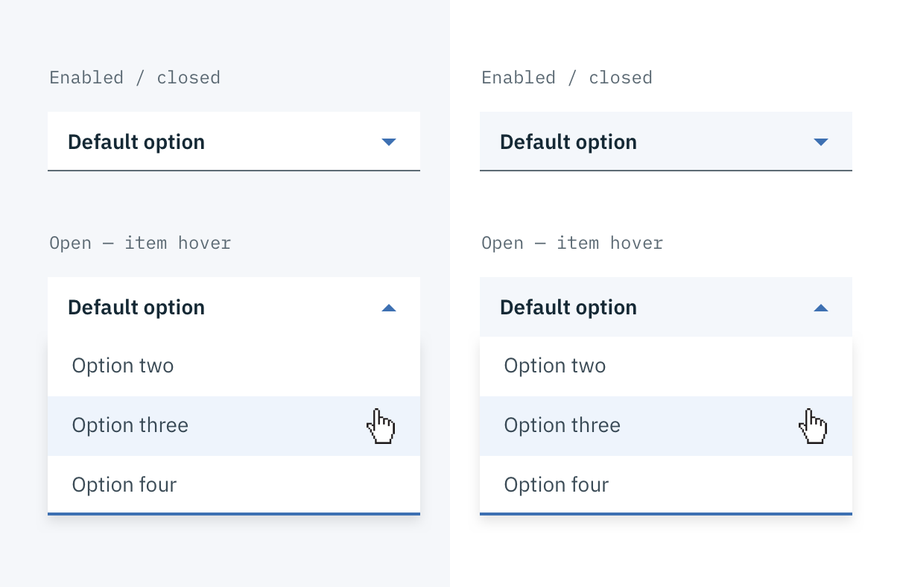
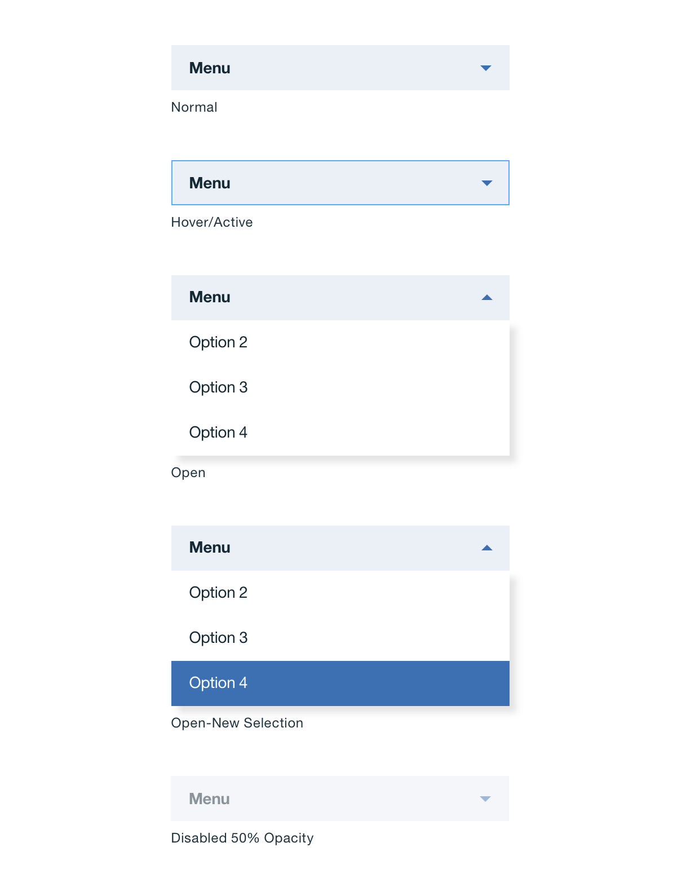
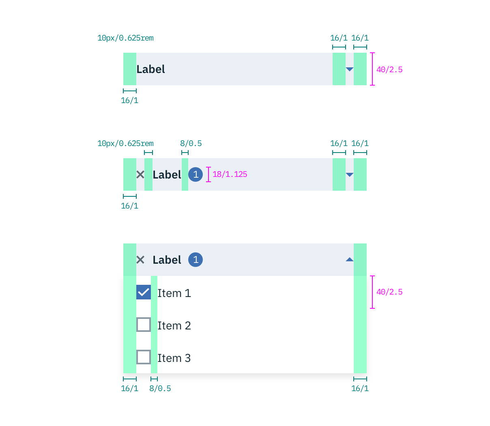
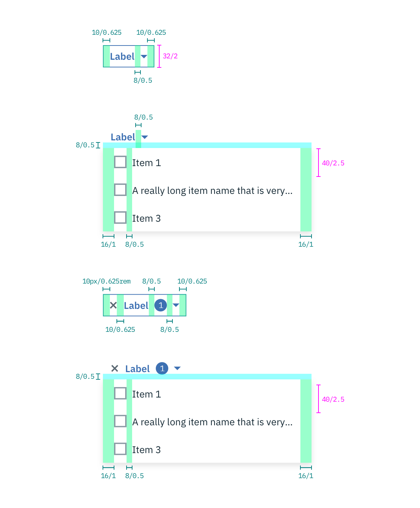
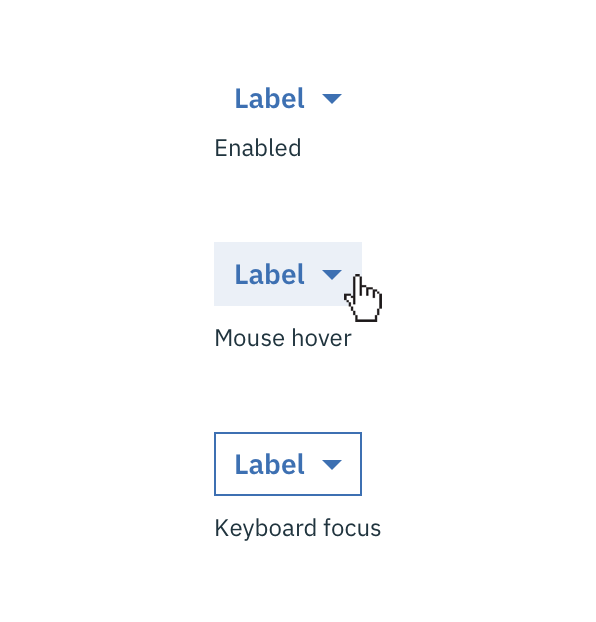
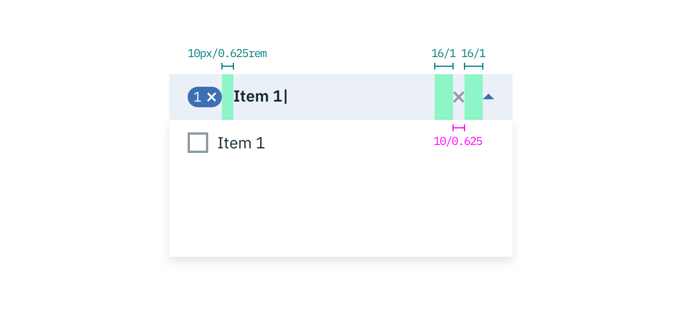
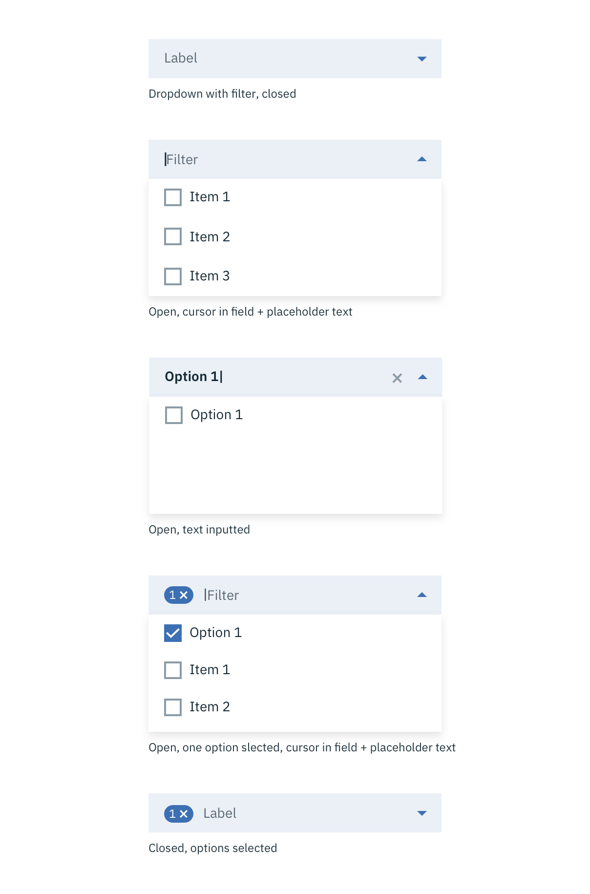

## Color

Inputs come in two different colors. The default input color is `$field-01` and is used on `$ui-01` page backgrounds. The light version input color is `$field-02` and is used on `$ui-02` page backgrounds.

| Color              | SCSS            | HEX       |
|--------------------|-----------------|-----------|
| Background: input default | $field-01     | #f4f7fb |
| Background: input light | $field-02     | #ffffff |
| Background: drawer  | $ui-01          | #ffffff   |
| Label: enabled           | $text-01   | #152934   |
| Label: focused           | $brand-01  | #3d70b2   |
| Label: error             | $support-01 | #e0182d |
| Text: user input    | $text-01        | #152935   |
| Text: placeholder        | $text-03        | #cdd1d4   |
| Text: error message      | $support-01        | #e0182d   |
| Row:hover      | $hover-row       | #5596e6 at 10% opacity   |
| Caret              | $brand-01       | #3d70b2   |
| Border bottom: enabled | $ui-05 | #5a6872 |
| Border bottom: focused | $brand-01 | #3d70b2 |
| Border bottom: error | $support-01 | #e0182d |

_Example of Dropdowns with $field-02 (left) and $field-01 (right)_

## Typography
All Dropdown text should be set in sentence case, with only the first word in a phrase and any proper nouns capitalized. Dropdown options should not exceed three words.

| Property    | Font-size       | Font-weight  | Type style |
|-------------|-----------------|--------------|------------|
| Label       | 14 / 0.875 | Semi-bold / 600   | Zeta
| Option | 14 / 0.875 | Normal / 400 | - |
| Label: filter | 14 / 0.875 | Normal / 400   | - |
| Text: filter placeholder | 14 / 0.875 | Normal / 400   | - |
| Text: user input | 14 / 0.875 | Semi-bold / 600   | Zeta |
| Text: error message | 12 / 0.75 | Normal / 400 | - |

## Layer
| Layer      | Elevation     | Box-shadow    |
|------------|----------|----------|
| Overlay    | 8        | `0 4px 8px 0 rgba(0,0,0,0.10);`  |

## Structure
Dropdowns have two states, open and closed. An open and closed Dropdown should be the same width and appropriately fit the design, layout, and content. The height of a closed Dropdown stays consistent while the height of an open Dropdown will vary based on the amount of options it has. Please note the various color differences for closed and open Dropdowns.

| Property         | px | rem |
|------------------|----|-----|
| Height           | 40 | 2.5 |
| Internal spacing | 16 | 1   |
| Border bottom: enabled | 1 | 0.0625rem |
| Border bottom: focused | 2 | 0.125 |

_Structure and spacing measurements for Dropdown | px / rem_

### States

**Error:** Error messages appear below the input field and are always present while invalid.

**Disabled:** Disabled state appears at 50% opacity and has a `.not-allowed` cursor on hover.

_Normal, active, open, and disabled states for Dropdown_

## Multi-Select Dropdown

| Property                           | px | rem   |
|------------------------------------|----|-------|
| Height                             | 40 | 2.5   |
| Internal spacing                   | 16 | 1     |
| Row height                         | 40 | 2.5   |
| Spacing: checkbox & label | 8  | 0.5   |
| Spacing: badge & label             | 8  | 0.5   |
| Spacing: label & caret             |16≤ | 1≤    |
| Badge height                       | 18 | 1.125 |
| Badge width                        | Varies based on value |  |

_Structure and spacing measurements for a Multi-Select Dropdown | px / rem_

<!--
_Hover and focus zstates for a Multi-Select Dropdown_-->

## Inline Dropdown

| Property                           | px | rem   |
|------------------------------------|----|-------|
| Height                             | 32 | 2     |
| Internal spacing                   | 8 | 0.5 |
| Spacing: label & dropdown menu     | 8 | 0.5 |
| Row height                         | 40 | 2.5   |
| Spacing: checkbox & label | 8  | 0.5   |
| Spacing: badge & label             | 10 | 0.625 |
| Spacing: label & caret             | 8≤ | 0.5≤  |
| Badge height                       | 18 | 1.125 |
| Badge width                       | Varies based on value |  |

_Structure and spacing for Inline Dropdown | px / rem_

### Inline Dropdown states
Inline select has two different states, one for mouse hover and one for keyboard focus.

---
***
> 

_Hover and focus states for Inline Dropdown_

## Filtering
Filtering can be used with Dropdown and Multi-select Dropdown but not Inline Dropdown.

| Property                           | px | rem   |
|------------------------------------|----|-------|
| Clear icon height & width          | 8  | 0.5 |
| Spacing: caret & clear icon        | 16 | 1     |
| Spacing: clear icon & typed text   | 16 | 1     |

_Spacing for Multi-select Dropdown with Filtering | px / rem_

_Interaction states for Multi-select Dropdown with Filtering | px / rem_

### States

**Error:** Error messages appear below the input field and are always present while invalid.

**Disabled:** Disabled state has a `.not-allowed` cursor hover and appears at 50% opacity.
