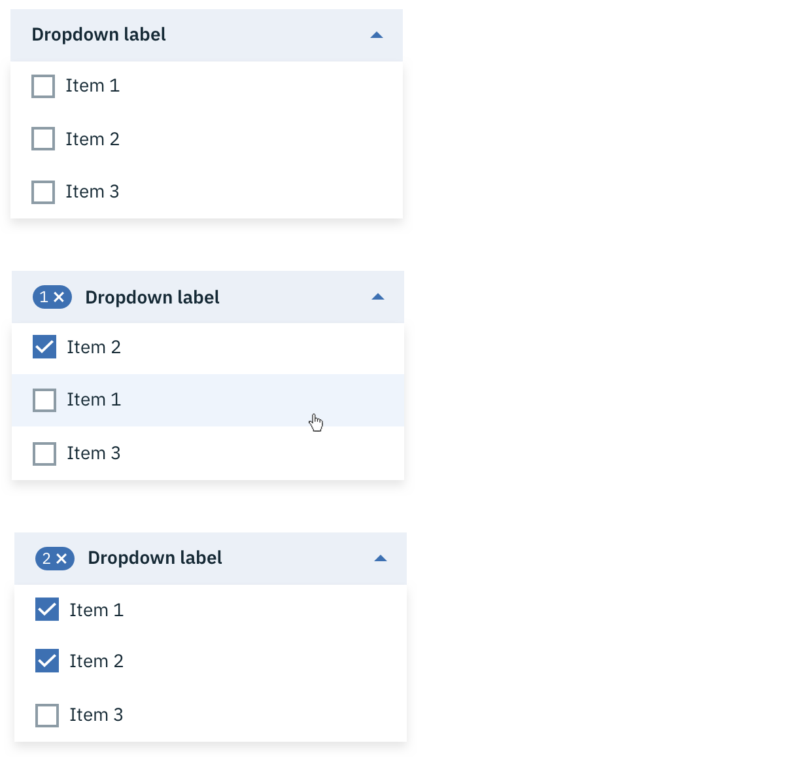
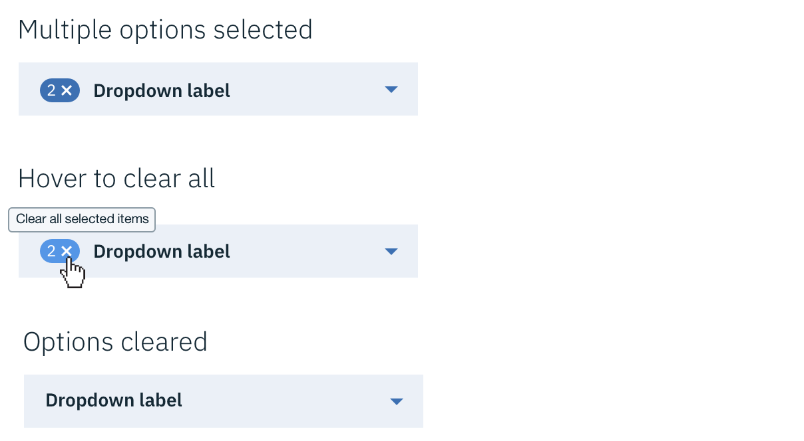
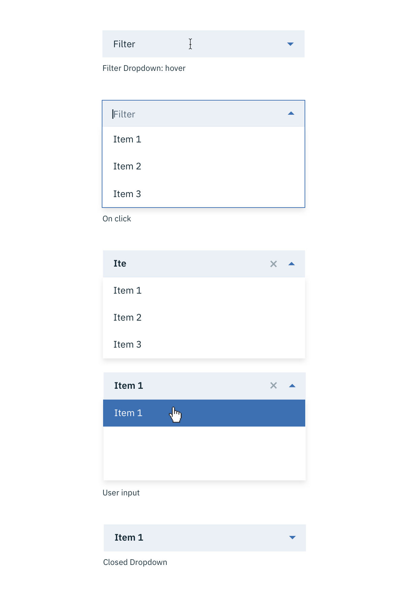

## General guidelines

### Text

Limit Dropdown content to a single line of text that describes the action it will perform when selected. Do not use multiple lines of text, images, or icons within a Dropdown. Sort the items in logical order, such as grouping related options together.

### Length

Keep Dropdown options succinct. Long Dropdowns that require scrolling make it difficult for users to see all their options in one glance.

## Interaction

Dropdowns should appear on click rather than on hover. Hover-activated Dropdowns increase cognitive load on users and are not recommended due to usability issues. Dropdowns should appear above all other elements within the UI. They can be dismissed by clicking outside of the dropdown item or on the parent element. Selecting an item from the dropdown will also dismiss it.

## Usage

A Dropdown may be used to filter a set of data.

_Dropdown to filter table data_
