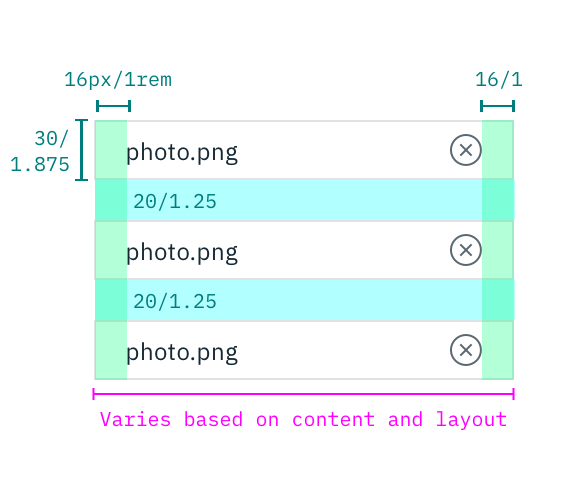

## Color

| Attribute              | SCSS            | HEX     |
|--------------------|-----------------|---------|
| Text: label        | $text-01        | #152934 |
| Text: instructions | $text-02        | #5a6872|
| Text: file name    | $text-01        | #152935 |
| Background: file   | $brand-01 @ 25% | #3d70b2 |
| Icon: remove       | $inverse-01     | #152934 |
| Icon: loading      | $ui-05          | #5a6872 |

## Typography

The File Uploader label and instruction text should be set in sentence case, with only the first letter of the first word in the sentence capitalized.

| Property         | Font-size (px/rem)     | Font-weight  | Type style |
|------------------|-----------------|--------------|---|
| Label            | 14 / 0.875 | Semi-Bold / 600   | Zeta |
| Instruction text | 14 / 0.875 | Normal / 400 | -    |
| File name        | 12 / 0.75  | Normal / 400 | -    |

## Structure

The width of an uploaded file varies based on the content and layout of a design. Refer to the [Button](/components/button) guidelines for styling and usage of the “Add files” button.

| Property               | px | rem   |
|------------------------|----|-------|
| Height                 | 30 | 1.875 |
| Icon: remove           | 16 | 1     |
| Icon: loading          | 16 | 1     |
| Spacing: uploaded file | 20 | 1.25  |
| Spacing: remove icon   | 16 | 1     |

---
***
> 

_Structure and spacing measurements for File Uploader | px / rem_
