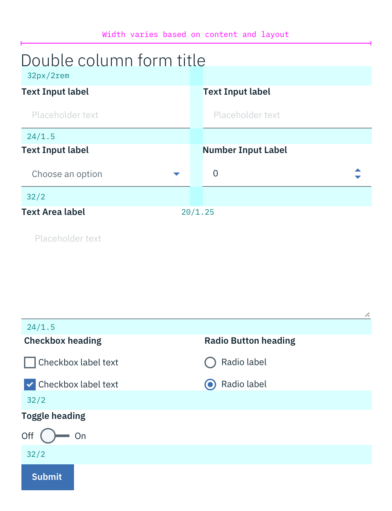
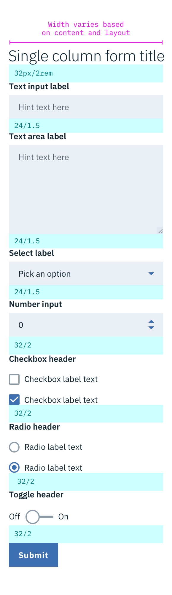

## Color

For color specs, refer to specific components.

## Typography

Form headings and labels should be set in set in sentence case with the first letter of each word capitalized. Please refer to the [Text Input](/components/text-input), [Dropdown](/components/dropdown), [Checkbox](/components/checkbox), [Radio button](/components/radio-button), [Toggle](/component/toggle), [Button](/component/button) pages for specific typography details on each component.

| PROPERTY | FONT-SIZE (px/rem)     | FONT-WEIGHT  |
|------------|-----------------|--------------|
| Heading    | 32 / 2     | Light / 300  |
| Label      | 14 / 0.875 | Bold / 700   |
| Input text | 14 / 0.875 | Normal / 400 |

## Structure

Forms are made up of several different components. The order in which these elements are arranged is flexible, but should always follow the spacing guidelines below.

Forms can be one column or two. The width of each column varies based on the content and layout of the design. On mobile, forms can only have one column.

All icons can be found on the [iconography](/style/iconography/library) library page.

| SPACE BETWEEN        | PX | REM  |
|----------------------|----|------|
| Text inputs          | 24 | 1.5  |
| Non-input components | 32 | 2    |
| Columns              | 20 | 1.25 |

_Structure and spacing measurements for a double column Form | px / rem_

---
***
> 

_Structure and spacing measurements for a single column Form | px / rem_
