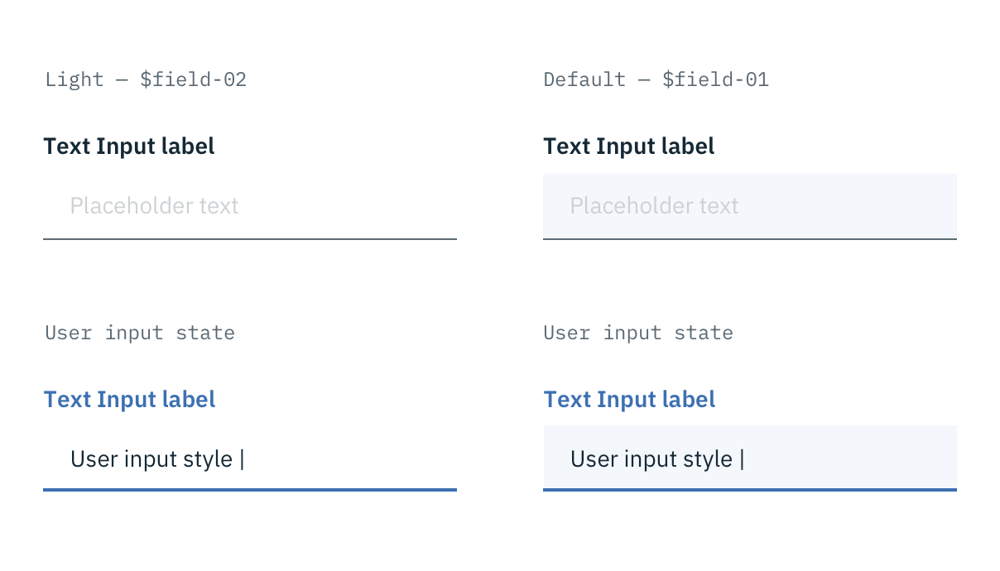

## Color

Form inputs come in two different colors. The default input color is `$field-01` and is used on `$ui-01` page backgrounds. The light version input color is `$field-02` and is used on `$ui-02` page backgrounds. For full color specs, refer to each specific component.

_Example of light fields with $field-02 (left) and the default version with $field-01 (right)_

## Typography

Form headings and labels should be set in sentence case with the first letter of the first word capitalized. Please refer to the [Text Input](/components/text-input), [Dropdown](/components/dropdown), [Checkbox](/components/checkbox), [Radio button](/components/radio-button), [Toggle](/component/toggle), [Button](/component/button) pages for specific typography details on each component.

| Property | Font-size (px/rem)     | Font-weight  | Type style |
|------------|-----------------|--------------|---|
| Heading    | 28 / 1.75    | Light / 300  | Beta |
| Label      | 14 / 0.875 | Semi-Bold / 600   | Zeta |
| Text: input | 14 / 0.875 | Normal / 400 | - |
| Text: error message | 12 / 0.75 | Normal / 400 | - |
| Text: help | 12 / 0.75 | Normal / 400 | - |
| Text: placeholder | 14 / 0.875 | Normal / 400 | - |

## Structure

Forms are made up of several different components. The order in which these elements are arranged is flexible, but should always follow the spacing guidelines below.

Forms can be one column or two. The width of each column varies based on the content and layout of the design. On mobile, forms can only have one column.

All icons can be found on the [iconography](/style/iconography/library) library page.

| Space between       | px | rem  |
|----------------------|----|------|
| Inputs               | 24 | 1.5  |
| Non-input components | 32 | 2    |
| Columns              | 20 | 1.25 |

_Structure and spacing measurements for a double column Form | px / rem_

---
***
> 

_Structure and spacing measurements for a single column Form | px / rem_

### States

**Active:** Placeholder text should remain when the user clicks into the text input and gets a cursor. Once the user starts typing the hint text is replaced with the user input text.

**Help text:** Help text appears below the label when the input is active. Help text remains visible while the input is focused and disappears after focus away.

**Error:** Error messages appear below the input field and are always present while invalid.

**Disabled:** Disabled state appears at 50% opacity and has a `.not-allowed` cursor on hover.
