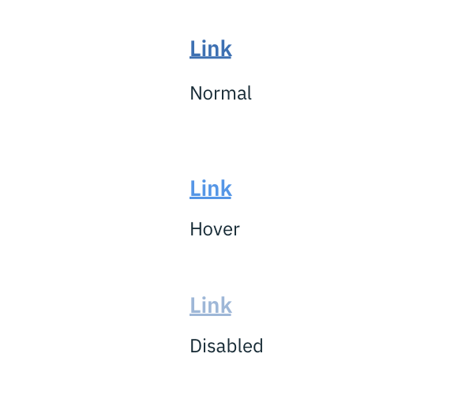
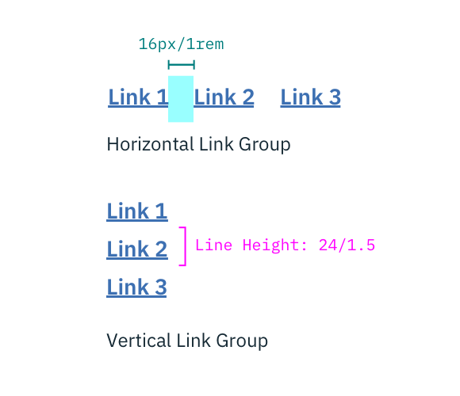

## Color

| ATTRIBUTE    | SCSS          | HEX           |
|----------|---------------|---------------|
| Normal   | $brand-01     | #3d70b2       |
| Hover    | $brand-02     | #5596e6       |
| Disabled | $brand-01     | #3d70b2 @ 50% |

---
***
> 

_Normal, hover disabled Link states_

## Typography

Link text should be set in set in sentence case with the first letter of each word capitalized. Links should not exceed three words.

| PROPERTY  | FONT-SIZE (px/rem)   | FONT-WEIGHT |
|------------|-----------------|--------------|
| Text       | 14 / 0.875 | Bold / 700   |

## Structure

Links can be grouped horizontally or vertically and must be underlined.

| PROPERTY             | PX | REM  |
|----------------------|----|------|
| Line height          | 24 | 1.5  |
| Horizontal spacing   | 16 | 1    |

---
***
> 

_Structure and spacing measurements for Link | px / rem_
