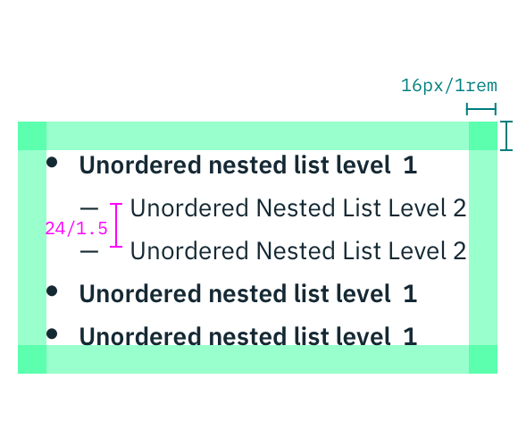
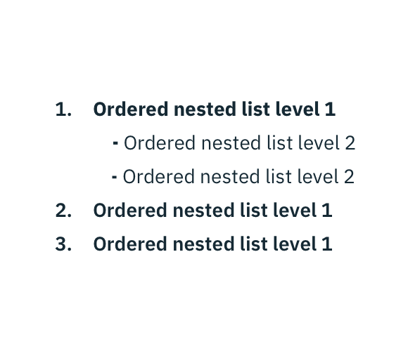

## Color

| COLOR    | SCSS          | HEX      |
|----------|---------------|----------|
| Text     | $text-01      | #152934  |

## Typography

Level 1 and 2 of any list type should be set in bold and sentence case, with only the first word in a phrase and any proper noun capitalized. **Line height** for lists should be set at 24px / 1.5rem.

| PROPERTY | FONT-SIZE      | FONT-WEIGHT  |
|----------|-----------------|--------------|
| Level 1  | 14px / 0.875rem | Bold / 700   |
| Level 2  | 14px / 0.875rem | Normal / 400 |

## Structure

There are two types of Lists, ordered and unordered.
Level 1 ordered list points are marked numerically while Level 2 points are marked with a dash.
Level 1 unordered list points are bulleted while Level 2 points are marked with a dash.

| PROPERTY             | PX | REM  |
|----------------------|----|------|
| External spacing     | 16 | 1    |

---
***
> 

---
***
> 

_Structure and spacing measurements for an ordered and an unordered List | px / rem_
