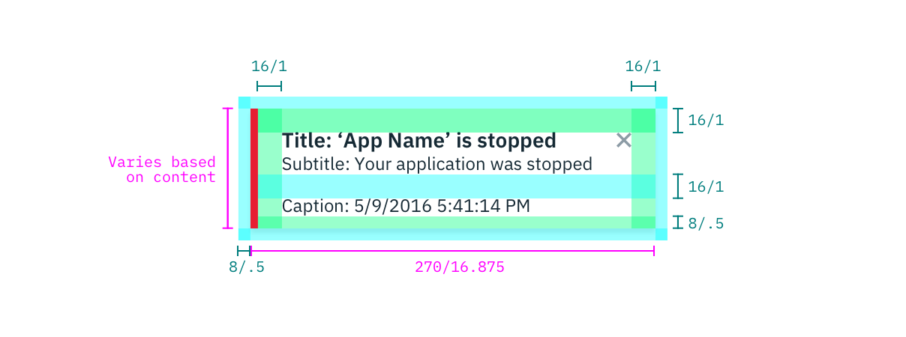
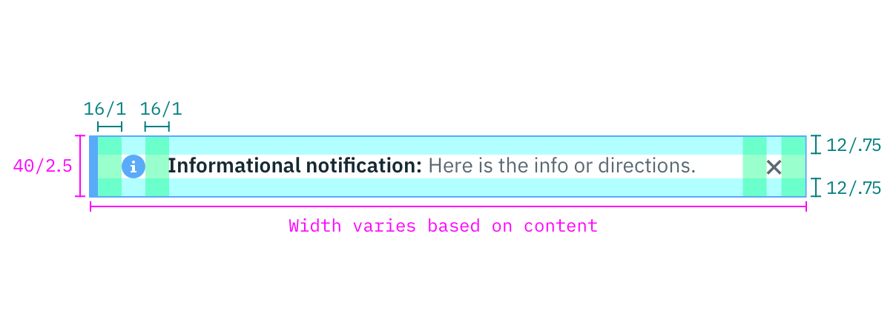

## Color
| COLOR         | SCSS        | HEX     |
|---------------|-------------|---------|
| Background    | $ui-01      | #ffffff |
| Error         | $support-01 | #e71d32 |
| Success       | $support-02 | #8cd211 |
| Warning       | $support-03 | #efc100 |
| Informational | $support-04 | #7cc7ff |
| Title         | $text-01    | #152935 |
| Text          | $text-02    | #5a6872 |
| X icon        | $ui-05      | #8c9ba5 |

## Typography 
Notification titles should not exceed more than three words. Notification text should be set in sentence case with only the first word capitalized.

| PROPERTY | FONT-SIZE      | FONT-WEIGHT  |
|----------|-----------------|--------------|
| Title    | 14px / 0.875rem | Bold / 700   |
| Text     | 14px / 0.875rem | Normal / 400 |

## Structure
### Toast Notification
| PROPERTY           | PX  | REM    |
|--------------------|-----|--------|
| Height             | varies based on content  | 5      |
| Width              | 270 | 16.875 |
| Spacing: external  | 8   | .5      | 
| Spacing: left, top, right | 16  | 1      |
| Spacing: text      | 16  | 1      |

_Structure and spacing measurements for a toast Notification | px / rem_

### Inline Notification
The width of an Inline Notificaiton will vary based on content. 

| PROPERTY          | PX | REM  |
|-------------------|----|------|
| Height: one-line  | 40 | 2.5  |
| Height: two lines | 56 | 3.5  |
| Icon              | 16 | 1    |
| X icon            | 10 | .625 |
| Border            | 1  | -    |
| Border-left       | 5  | -    |
| Spacing: icons    | 16 | 1    |
| Spacing: top, bottom | 12 | .75|

_Structure and spacing measurements for a inline Notification | px / rem_
