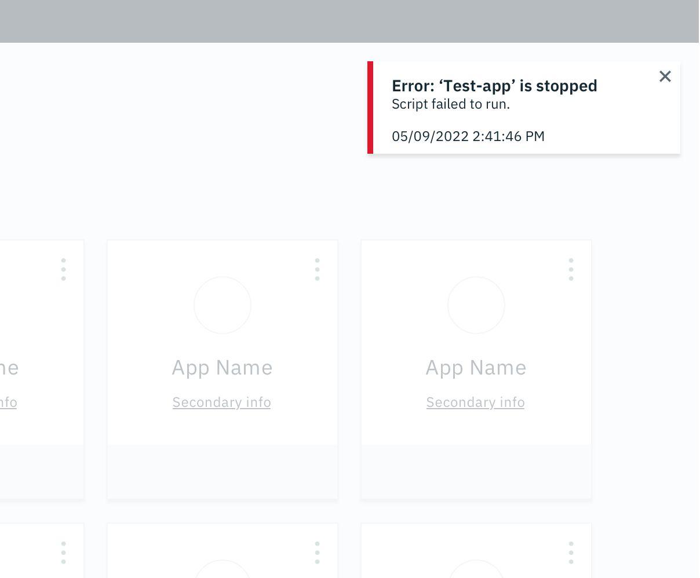
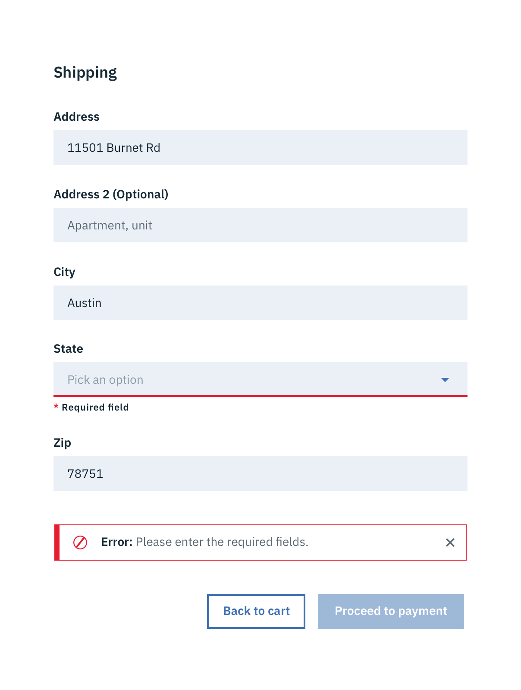

## Format

### Size

Toast Notifications have a fixed width but the height may vary depending on the content. The width and height of Inline Notifications may vary depending on content.

### Title

All notifications have subject titles.

### Message

The body of the notification should be contained within two lines. Be descriptive and include any troubleshooting actions or next steps. When possible, communicate the main message using just the title.

### Dismissal

All notifications have at least one method of dismissal. Typically, it is a small “x” in the upper right hand corner.

### Icons

Icons may provide additional clarity. Icons should be placed to the left of a title. These glyphs (16x16) can be found in the [iconography](/style/iconography/library) library.

---
***
> 

## Placement

### Toast Notifications

Toast Notifications slide in and out a page from the top-right corner. Actionable notifications do not appear on mobile screen widths.

### Inline Notifications

Inline Notifications appear near its related item.

