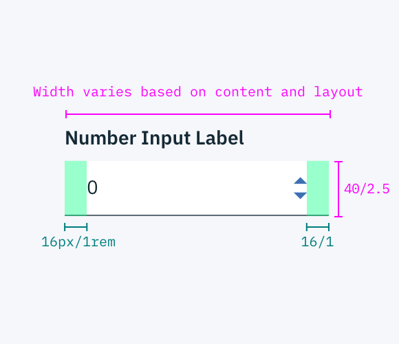

## Color
| COLOR                | SCSS      | HEX           |
|----------------------|-----------|---------------|
| Background           | $field-01 | #3d70b2 @ 10% |
| Text: label & number | $text-01  | #152935       |
| Caret                | $brand-01 | #3d70b2       |

## Typography
Number Input labels should use sentence case, with only the first word in a phrase and any proper nouns capitalized.

| PROPERTY  | FONT-SIZE      | FONT-WEIGHT  |
|------------|-----------------|--------------|
| Label       | 14px / 0.875rem | Bold / 700   |
| Text        | 14px / 0.875rem | Normal / 400   |

## Structure
The height of a Number Input is always the same. The width however, varies based on content, layout and design. The arrows icon can be found in the [iconography](/style/iconography/library) library.

| PROPERTY         | PX | REM |
|------------------|----|-----|
| Height           | 40 | 2.5 |
| Internal spacing | 16 | 1   |

_Structure and spacing measurements for a Number Input | px / rem_
