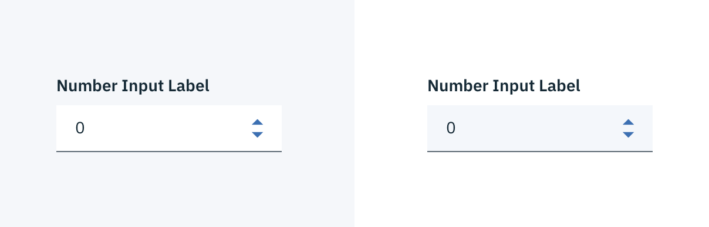

## Color

Inputs come in two different colors. The default input color is `$field-01` and is used on `$ui-01` page backgrounds. The light version input color is `$field-02` and is used on `$ui-02` page backgrounds.

| Attribute                | SCSS      | HEX           |
|----------------------|-----------|---------------|
| Background: default | $field-01     | #f4f7fb |
| Background: light | $field-02     | #ffffff |
| Label: enabled           | $text-01   | #152934   |
| Label: focused           | $brand-01  | #3d70b2   |
| Label: error             | $support-01 | #e0182d |
| Text: number | $text-01  | #152935       |
| Text: error message      | $support-01        | #e0182d   |
| Caret                | $brand-01 | #3d70b2       |
| Border bottom: enabled | $ui-05 | #5a6872 |
| Border bottom: focused | $brand-01 | #3d70b2 |
| Border bottom: error | $support-01 | #e0182d |

_Number Input example in $field-02 (left) and $field-01 (right)_

## Typography

Number Input labels should use sentence case, with only the first word in a phrase and any proper nouns capitalized.

| Property  | Font-size (px/rem)      | Font-weight  | Type style |
|------------|-----------------|--------------|----|
| Label       | 14 / 0.875 | Semi-Bold / 600   | Zeta |
| Text        | 14 / 0.875 | Normal / 400   | - |
| Text: error message | 12 / 0.75 | Normal / 400 | - |

## Structure

The height of a Number Input is always the same. The width however, varies based on content, layout and design. The caret icon can be found in the [iconography](/style/iconography/library) library.

| Property         | px | rem |
|------------------|----|-----|
| Height           | 40 | 2.5 |
| Internal spacing | 16 | 1   |
| Border bottom: enabled | 1 | 0.0625rem |
| Border bottom: focused | 2 | 0.125 |

---
***
> 

_Structure and spacing measurements for a Number Input | px / rem_

### States

**Active:** Number input should have a default number to start. The input should never be empty.

**Help text:** Help text appears below the label when the input is active. Help text remains visible while the input is focused and disappears after focus away.

**Error:** Error messages appear below the input field and are always present while invalid.

**Disabled:** Disabled state appears at 50% opacity and has a `.not-allowed` cursor on hover.

