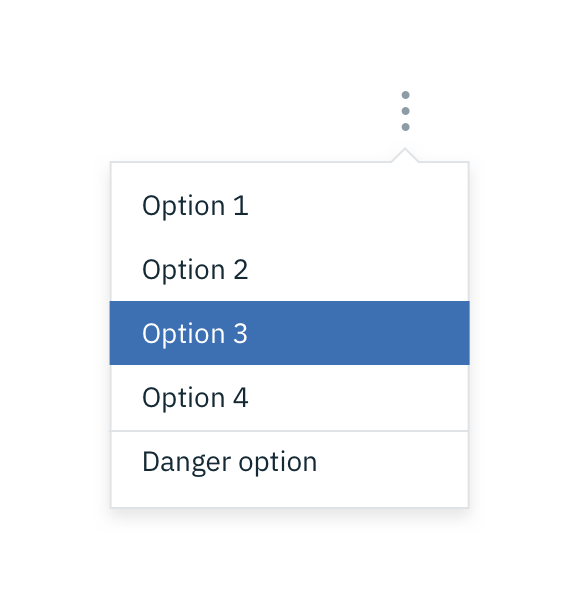
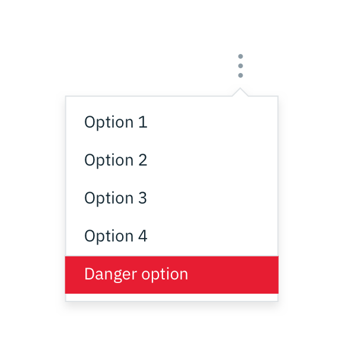
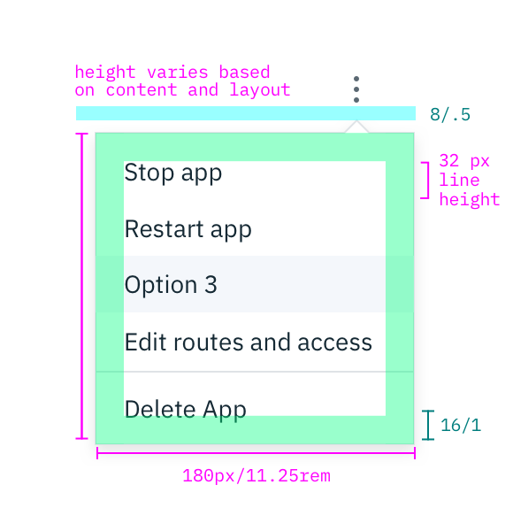

## Color

| ATTRIBUTE          | SCSS        | HEX     |
|----------------|-------------|---------|
| Icon           | $ui-05      | #8c9ba5 |
| Background     | $ui-01      | #ffffff |
| Text           | $text-01    | #152935 |
| Icon: hover    | $brand-01   | #3d70b2 |
| Text: hover    | $inverse-01 | #ffffff |
| Warning: hover | $support-01 | #e71d32 |
| Line           | $ui-04      | #dfe3e6 |

  

    
  

  

    
  

_Text and warning hover examples for Overflow Menu_

## Typography

Overflow Menu text should be set in set in sentence case with the first letter of each word capitalized.

| PROPERTY | FONT-SIZE (px/rem)    | FONT-WEIGHT |
|------------|-----------------|--------------|
| Label      | 14 / 0.875 | Normal / 400 |

## Layer

| LAYER      | ELEVATION     | BOX-SHADOW      |
|------------|----------|----------|
| Overlay    | 8        | `0 4px 8px 0 rgba(0,0,0,0.10);`  |

## Structure

The height of an Overflow Menu is determined by the amount of content in the menu. The Overflow Menu icon can be found in the [iconography](/style/iconography/library) library.

| PROPERTY             | PX                      | REM   |
|----------------------|-------------------------|-------|
| Width                | 180                     | 11.25 |
| Height               | Varies based on content |       |
| Divider line         | 1                       | -     |
| Internal spacing     | 16                      | 1     |
| Spacing: icon & menu | 8                       | 0.5   |

---
***
> 

_Structure and spacing measurements for Overflow Menu | px / rem_
