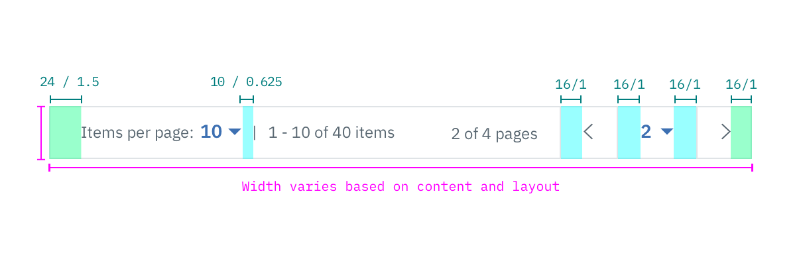

## Color

| ATTRIBUTE          | SCSS    | HEX         |
|----------------|---------|-------------|
| Background     | $ui-01  | #ffffff     |
| Text           | $text-02| #5a6872     |
| Border         | $ui-04  | #dfe3e6     |
| Chevron        | $ui-05  | #8c9ba5     |

## Typography

Pagination text should be set in set in sentence case with the first letter of each word capitalized.

| PROPERTY       | FONT-SIZE (px/rem)     | FONT-WEIGHT |
|------------------|-----------------|--------------|
| Secondary text   | 12 / 0.75  | Normal / 400 |

## Structure

The Pagination bar is most commonly used in [Data Tables](/components/data-table). The width can vary depending on content and layout, but should span the entire width of the table it's being paired with. The size of the chevron is 10px by 5px.

| PROPERTY                           | PX        | REM   |
|------------------------------------|-----------|-------|
| Height                             | 40        | 2.5   |
| Width                              | Varies based on content and layout | |
| Border                             | 1         | -     |
| Spacing: left & right              | 16        | 1     |
| Spacing: small select & items text | 10        | 0.625  |
| Spacing: page text & chevron       | 16        | 1     |
| Spacing: chevron & page number     | 30        | 1.875 |

_Structure and spacing measurements for Pagination | px / rem_
