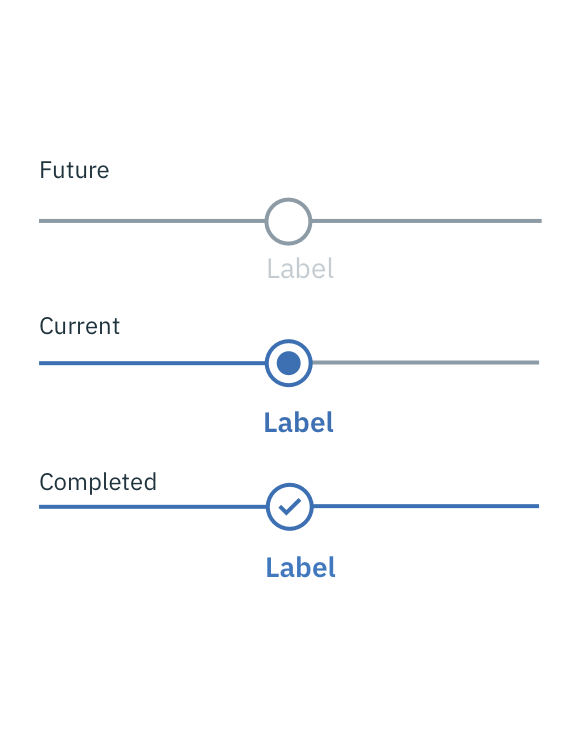
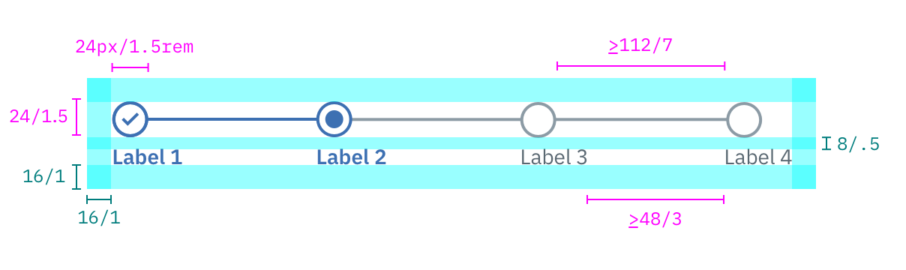

## Color

All steps that have already been completed are indicated by an outlined circle with a checkmark. The current step the user is on is indicated by a filled circle. Steps the user has not encountered yet, or future steps, are indicated by an outlined circle.

| ATTRIBUTE                       | SCSS      | HEX     |
|---------------------------------|---------  |---------|
| Label: current & completed      | $brand-01 | #3d70b2 |
| Label: future step              | $text-02  | #5a6872 |
| Line: current & completed       | $brand-01 | #3d70b2 |
| Line: future step               | $ui-05    | #8c9ba5 |
| Icon: current & completed       | $brand-01 | #3d70b2 |
| Icon: future step               | $ui-05    | #8c9ba5 |

---
***
> 

_Examples of current, completed, and future steps for Progress Indicator_

## Typography

Labels should be one to two words only, with a limit of 16 characters total per label. All labels should be set in sentence case.

| PROPERTY                 | FONT-SIZE (px/rem)    | FONT-WEIGHT  |
|--------------------------|-----------------|--------------|
| Current & completed step| 14 / 0.875 | Bold / 700   |
| Future steps | 14 / 0.875 | Normal / 400 |

## Structure

The checkmark icon can be found in the [iconography](/style/iconography/library) library.

| PROPERTY                 | PX  | REM   |
|--------------------------|-----|-------|
| Circle                   | 24  | 1.5   |
| Line weight              | 2   | -     |
| Line length (minimum)    | 112 | 7     |
| Spacing: steps (minimum) | 48  | 3     |
| Spacing: icon & label    | 8   | 0.5   |
| Spacing: icons external  | 16  | 1     |

_Structure and spacing measurements for Progress Indicator | px / rem_
