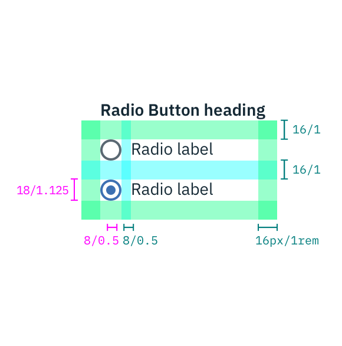

## Color

| ATTRIBUTE               | SCSS      | HEX       |
|---------------------|-----------|-----------|
| Non-selected border | $ui-05    | #8c9ba5   |
| Selected            | $brand-01 | #3d70b2   |

## Typography

Radio Button labels and headings should be set in sentence case, with only the first word in a phrase and any proper nouns capitalized.

| PROPERTY | FONT-SIZE (px/rem)   | FONT-WEIGHT  |
|----------|-----------------|--------------|
| Heading  | 14 / 0.875 | Bold / 700   |
| Label    | 14 / 0.875 | Normal / 400 |

## Structure

| PROPERTY                     | PX | REM   |
|------------------------------|----|-------|
| Button height & width        | 18 | 1.125 |
| Selected dot: height & width | 8  | 0.5   |
| External spacing             | 16 | 1     |
| Spacing: between options     | 16 | 1     |
| Spacing: label & button      | 8  | 0.5   |

---
***
> 

_Structure and spacing measurements for Radio Button | px | rem_
