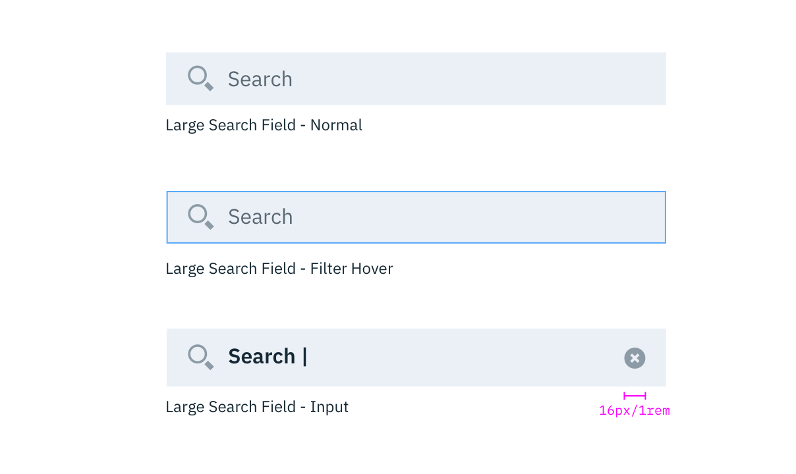
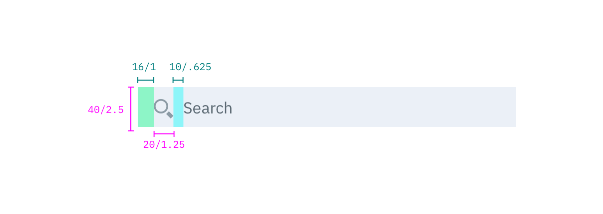
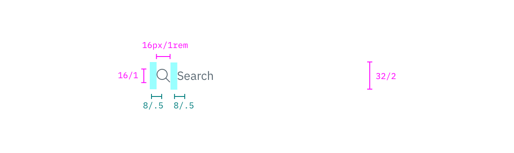

## Color

| ATTRIBUTE             | SCSS          | HEX      |
|-------------------|---------------|-----------|
| Background        | $field-01     | #3d70b2 @ 10% |
| Text: user input  | $text-01      | #152935  |
| Text: placeholder | $text-03      | #5a6872  |
| Icon              | $ui-05        | #8c9ba5  |

_Examples of normal, hover, and input Search states_

## Typography

Search text should be set in sentence case, with only the first letter of the first word capitalized.

| PROPERTY        | FONT-SIZE (px/rem)     | FONT-WEIGHT       |
|------------------|-----------------|---------------------|
| Placeholder text | 14 / 0.875 | Normal italic / 400 |
| Text             | 14 / 0.875 | Bold / 700          |

## Structure

The width of the Search field should appropriately fit the design and layout of content. Larger Search fields can include a filter button and a list/card view button.

| PROPERTY             | PX | REM   |
|----------------------|----|-------|
| Height: regular      | 44 | 2.75  |
| Height: small        | 32 | 2     |
| Icon: search         | 20 | 1.25  |
| Icon: small search   | 16 | 1     |
| Spacing: search icon | 10 | 0.625 |
| Spacing: small search icon | 12 | 0.75  |

_Structure and spacing measurements for Regular Search | px | rem_

_Structure and spacing measurements for Small Search | px | rem_
