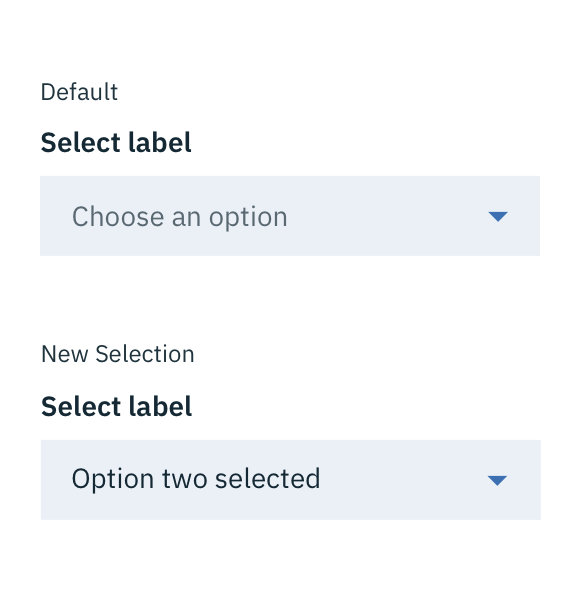
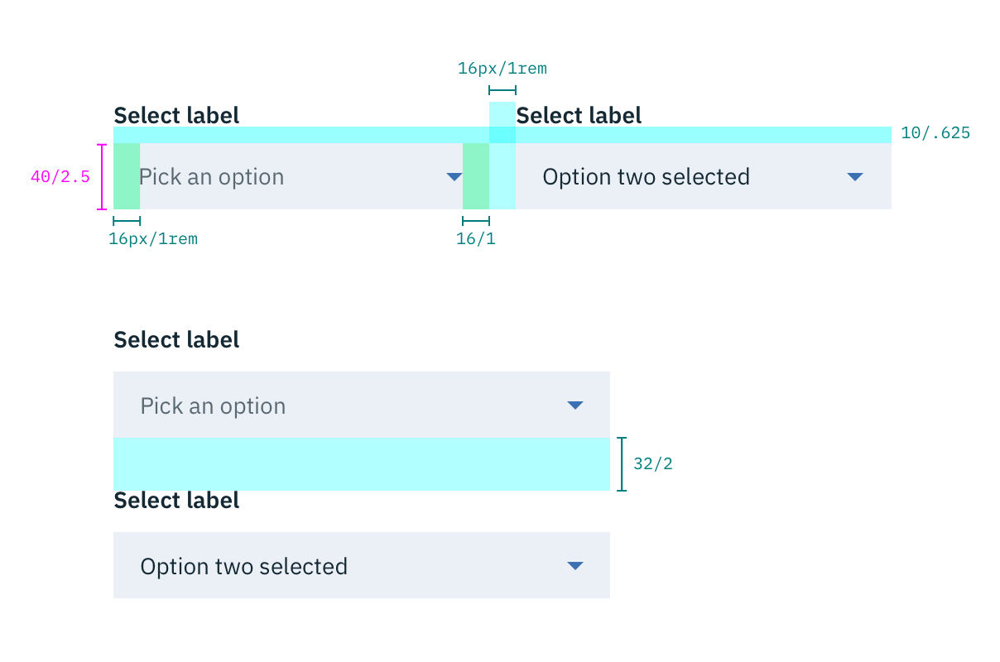
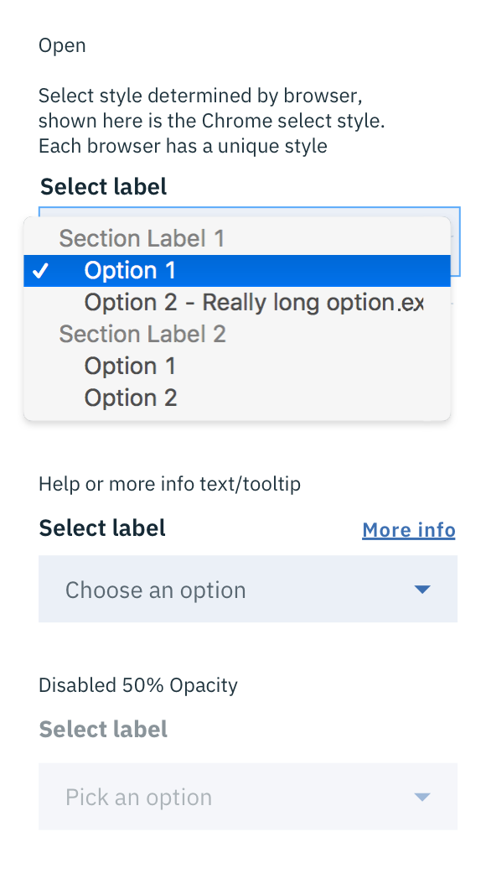
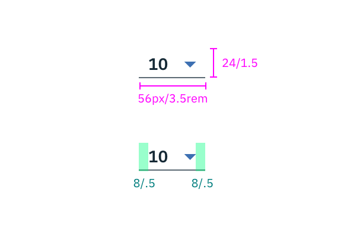
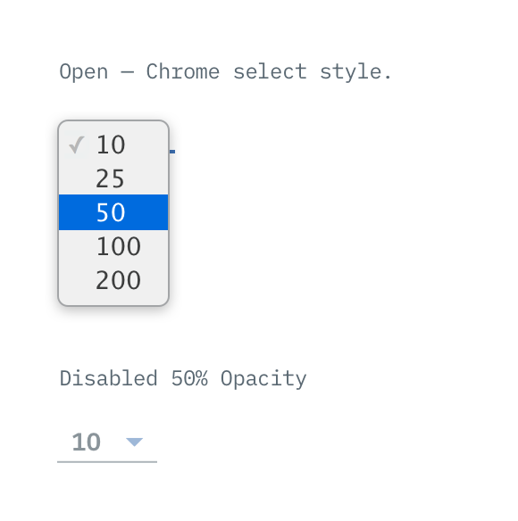
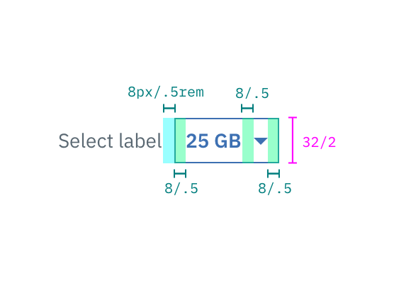

## Color

| ATTRIBUTE             | SCSS          | HEX      |
|-------------------|---------------|-----------|
| Background        | $field-01     | #3d70b2 @ 10% |
| Caret             | $brand-01     | #3d70b2   |
| Label             | $text-01      | #152935   |
| Label: inline select  | $text-03      | #5a6872   |
| Text              | $text-01      | #152935   |
| Text: inline select | $brand-01     | #3d70b2   |
| Text: placeholder | $text-03      | #5a6872   |

---
***
> 

_Examples of default and new selection Select states_

## Typography

Select text should be set in sentence case, with only the first word in a phrase and any proper nouns capitalized. Select text should be three words or less.

| PROPERTY | FONT-SIZE (px/rem)      | FONT-WEIGHT  |
|----------|-----------------|--------------|
| Label    | 14 / 0.875 | Bold / 700   |
| Label: inline select    | 14px / 0.875rem |  Normal / 400   |
| Text     | 14 / 0.875 | Normal / 400 |
| Text: inline select     | 14 / 0.875rem | Bold / 700 |

## Structure

| PROPERTY                    | PX | REM   |
|-----------------------------|----|-------|
| Height                      | 40 | 2.5   |
| Spacing: Label & field      | 10 | 0.625 |
| Internal spacing            | 16 | 1     |
| Groupings: vertical         | 32 | 2     |
| Groupings: horizontal       | 16 | 1     |

_Structure and spacing measurements for Select | px / rem_

### States

**Open:** Style determined by browser

**Disabled:** 50% opacity

**Help/More Info:** A Tooltip should appear when the user clicks the "More Info" link. The Tooltip indicator should be left aligned with the Select and underlined.

---
***
> 

_Examples of open, disabled, and help Select states_

### Small Select

| PROPERTY                    | PX | REM   |
|-----------------------------|----|-------|
| Height                      | 24 | 1.5   |
| Width                       | 56 | 3.5   |
| Internal spacing            | 8  | 0.5    |

  

    
  

  

    
  

_Structure and spacing measurements for Small Select | px / rem_

_Examples of open and disabled Small Select states_

### Inline select

| PROPERTY                    | PX | REM   |
|-----------------------------|----|-------|
| Height                      | 32 | 2     |
| Internal spacing            | 10  | 0.625    |

---
***
> 

_Structure and spacing measurements for Inline Select (on hover) | px / rem_
