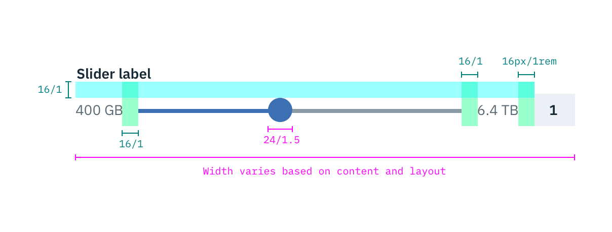

## Color
| ATTRIBUTE                | SCSS      | HEX      |
|-----------------------|---------  |----------|
| Handle: fill          | $brand-01 | #3d70b2  |
| Line: selected        | $brand-01 | #3d70b2  |
| Line: unselected      | $ui-05    | #8c9ba5  |
| Label                 | $text-01  | #152934  |
| Range values   | $text-02  | #5a6872  |

## Typography
Slider labels should be set in sentence case, with only the first word in a phrase and any proper nouns capitalized, and no more than three words.

| PROPERTY 			   | FONT-SIZE (px/rem)       | FONT-WEIGHT  |
|----------------------|-----------------|--------------|
| Label                | 14 / 0.875 | Bold / 700   |
| Range values  | 14 / 0.875 | Normal / 400 |

## Structure
The width of a Slider varies based on page content and layout.

| PROPERTY          | PX | REM   |
|-------------------|----|-------|
| Handle            | 24 | 1.5   |
| Slider line height| 4  | 0.25  |
| Spacing: Label & slider | 16 | 1   |
| Spacing: slider & range values | 16 | 1  |
| Spacing: range value & text input | 16 | 1  |

_Structure and spacing measurements for Slider | px / rem_
