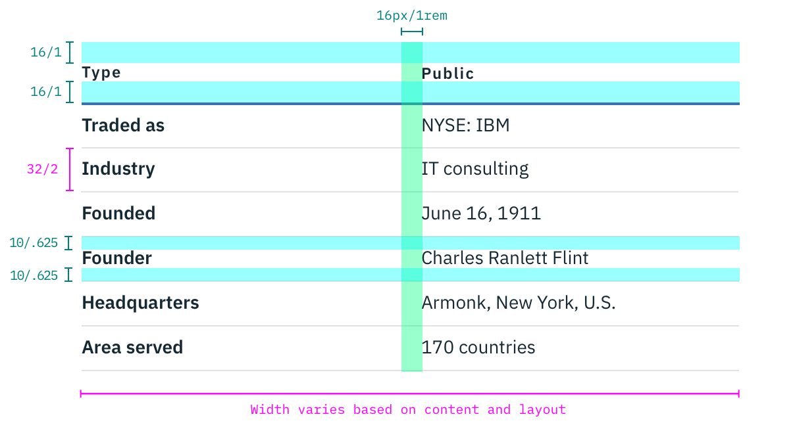
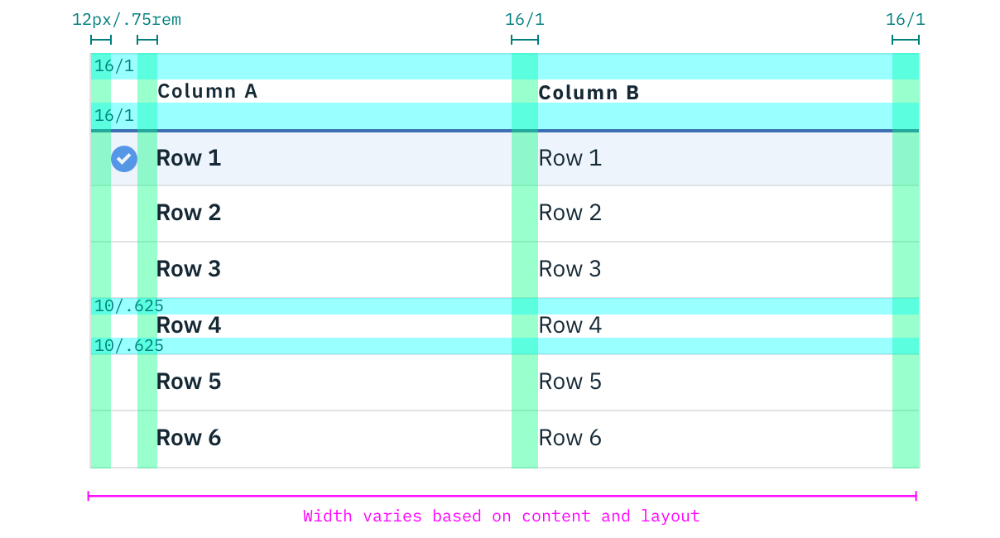

## Color
| Attribute    | SCSS          | HEX      |
|----------|---------------|----------|
| Text     | $text-01      | #152935  |
| Table header: border-bottom | $brand-01 | #3d70b2 |
| Optional border | $ui-04 | #8897a2    |
| Selection list row:hover  | $hover-row | #5596e6 at 10% opacity    |
| Checkmark icon | $brand-02  | #5596e6    |

## Typography
Structured List headers should be set in all caps, while all other text is set in sentence case. All typography is left aligned. **Line height** for Structured Lists should be set at 18px / 1.25rem.

| Property | Font-size (px/rem)     | Font-weight  | Type style |
|----------|-----------------|--------------|-- |
| Column header   | 12 / 0.75 | Semi-Bold / 600   | Omega |
| Text     | 14 / 0.875 | Normal / 400   | - |

## Structure
Structured Lists by default are not accompanied by a border, but one may be added for stylistic purposes, and should be set at 1px.  

| Property             | px | rem  |
|----------------------|----|------|
| Width                | varies based on content and layout |   |
| Spacing: content-right| 16 | 1    |
| Spacing: checkmark    | 12 | 0.75 |
| Row spacing: tall     | 16 | 1    |
| Row spacing: narrow   | 10 | 0.625|
| Checkmark glyph       | 16 | 1   |

_Spacing and measurements for Structured List | px / rem_

_Spacing and measurements for Structured List with selection | px / rem_
