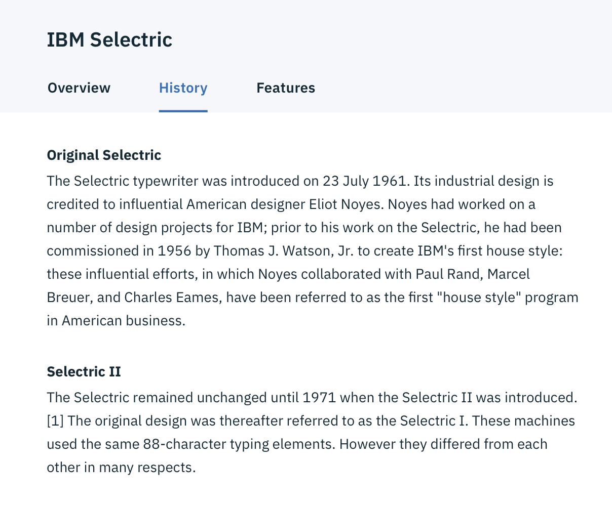

## General guidelines
### Text
Each Tab title describes its content and sets user expectations. Titles are concise and use one to two words maximum. Keep in mind that at mobile widths, the character length of a title will impact the experience.
Icons are not permitted in the Tab titles.

### Number of tabs
A maximum of six tabs may be displayed. This is to maintain an uncluttered UI and reduce cognitive load for users.

### Order
Tab order should be consistent across service instances. Tabs with related content should be grouped adjacent to each other.

