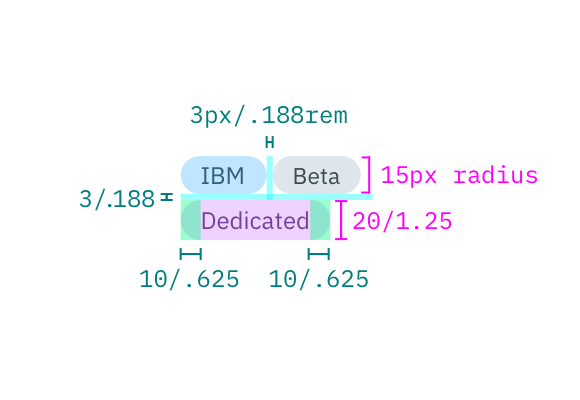

## Typography

Tag text should be set in sentence case, and should only have one word. However, if more than one is necessary, then connect the words using a hyphen with no spaces.

| PROPERTY | FONT-SIZE (px/rem)      | FONT-WEIGHT  |
|----------|----------------|--------------|
| Text     | 12 / 0.75 | Normal / 400 |

## Structure

All tags have the same height. However, the width of tags varies based on the amount of content. All four corners of a tag are rounded with a 15px radius.

| PROPERTY          | PX | REM   |
|-------------------|----|-------|
| Height            | 20 | 1.25  |
| Radius            | 15 | 0.938 |
| Spacing: tags     | 3  | 0.188 |
| Spacing: internal | 10 | 0.625 |

---
***
> 

_Structure and spacing measurements for a Tag | px / rem_
