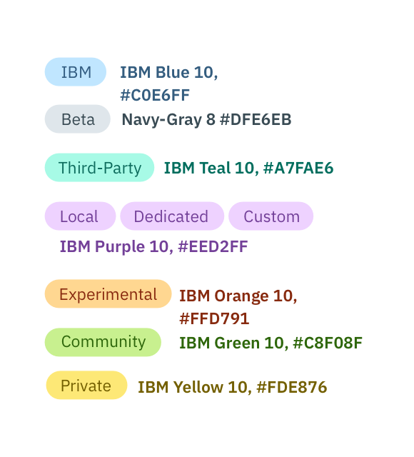

## Color

| Color                   | Tag Hex   | Text Hex |
|-------------------------------------|----------|
| IBM                     | #C0E6FF   | #325C80  |
| Beta                    | #DFE6EB   | #394B54  |
| Third-Party             | #A7FAE6   | #0D6C5D  |
| Local/Dedicated/Custom  | #EED2FF   | #734098  |
| Experimental            | #FFD791   | #872A0F  |
| Community               | #C8F08F   | #2D660A  |
| Private                 | #FDE876   | #735F00  |

---
***
> 

_Tag color examples_

## Typography

Tag text should be set in sentence case, and should only have one word. However, if more than one is necessary, then connect the words using a hyphen with no spaces.

| Property | Font-size (px/rem)      | Font-weight  |
|----------|----------------|--------------|
| Text     | 12 / 0.75 | Normal / 400 |

## Structure

All tags have the same height. However, the width of tags varies based on the amount of content. All four corners of a tag are rounded with a 15px radius.

| Property          | px | rem   |
|-------------------|----|-------|
| Height            | 20 | 1.25  |
| Radius            | 15 | 0.938 |
| Spacing: tags     | 3  | 0.188 |
| Spacing: internal | 10 | 0.625 |

---
***
> 

_Structure and spacing measurements for a Tag | px / rem_
