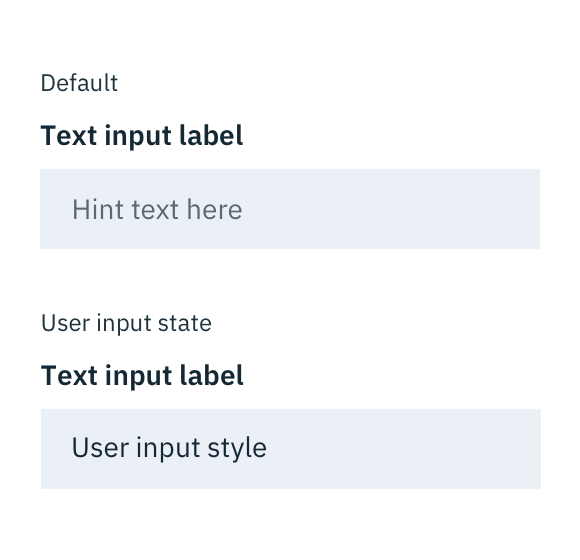
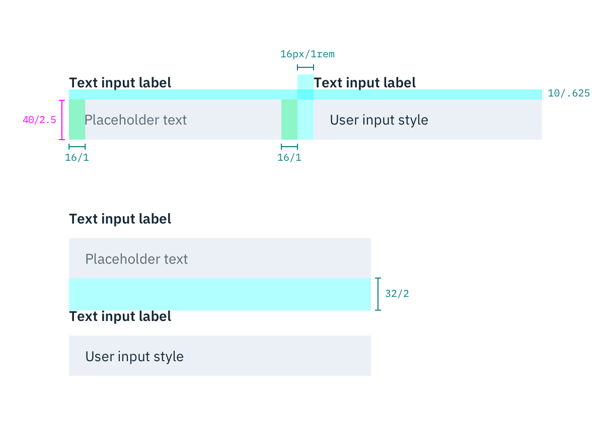
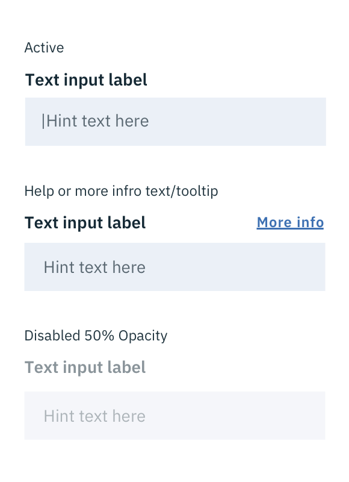

## Color

| ATTRIBUTE             | SCSS          | HEX           |
|-------------------|---------------|---------------|
| Background        | $field-01     | #3d70b2 @ 10% |
| Text: label       | $text-01      | #152935       |
| Text: user input  | $text-01      | #152935       |
| Text: placeholder | $text-03      | #5a6872       |

---
***
> 

_Examples of default and user-input states for Text Input_

## Typography

Text Input labels and placeholder text should be set in sentence case, with only the first word in a phrase and any proper nouns capitalized. Text Input labels should be three words or less.

| PROPERTY | FONT-SIZE (px/rem)     | FONT-WEIGHT  |
|----------|-----------------|--------------|
| Label    | 14 / 0.875 | Bold / 700   |
| Text     | 14 / 0.875 | Normal / 400 |

## Structure

| PROPERTY                    | PX | REM   |
|-----------------------------|----|-------|
| Height                      | 40 | 2.5   |
| Spacing: Label & select box | 10 | 0.625 |
| Internal spacing            | 16 | 1     |
| Groupings: vertical         | 32 | 2     |
| Groupings: horizontal       | 16 | 1     |

_Structure and spacing measurements for Text Input | px / rem_

### States

**Active:** Hint text should remain when the user clicks into the text input and gets a cursor. Once the user starts typing the hint text is replaced with the user input text.

**Help/More Info:** A Tooltip should appear when the user clicks the "More Info" link. The Tooltip indicator should be left aligned with the Text Input and underlined.

**Disabled:** 50% opacity

---
***
> 

_Examples of active, help, and disabled Text Input states_
