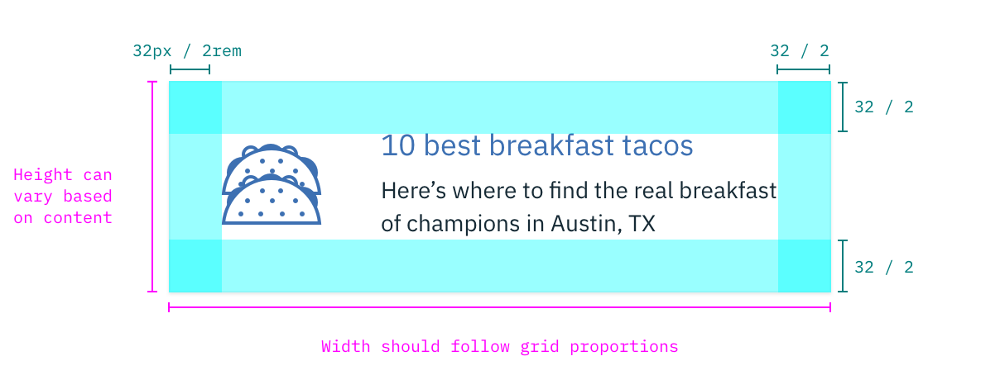
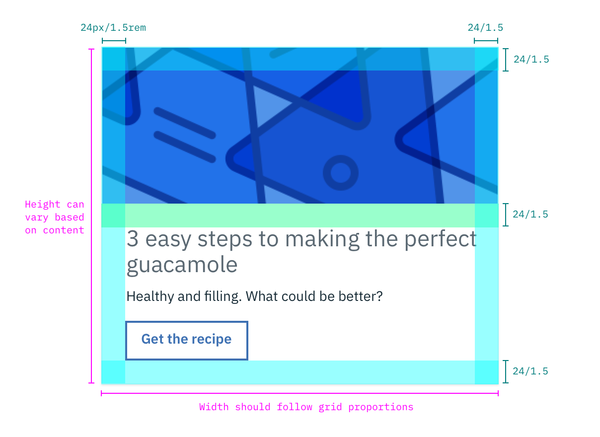

## Color
| COLOR             | SCSS          | HEX           |
|-------------------|---------------|---------------|
| Background        | $ui-01     | #ffffff |
| Border      | $ui-03      | #f0f3f6      |
| Border: hover       | $ui-04      | #dfe3e6       |
| Border: focus, selected       | $brand-01      | #3d70b2       |
| Chevron: collapsed  | $brand-01     | #3d70b2      |
| Chevron: expanded| $ui-05      | #8c9ba5       |
| Checkmark| $inverse-01      | #ffffff       |

## Layer

| LAYER | ELEVATION     | BOX-SHADOW  |
|----------|-----------------|--------------|
| Raised    | 2 | 	0 1px 2px 0 rgba(0,0,0,0.10);   |

## Structure
| PROPERTY                    | PX | REM   |
|-----------------------------|----|-------|
| Height: minimum             | 64 | 4   |
| Width                       | 128 | 8  |
| Padding: internal           | 16 | 1    |

_Structure and spacing measurements for Tile | px / rem_

_Structure and spacing measurements for Tile | px / rem_

### Proportions for grid
|  | XL 1600-1200 | L 1200-992 | M 992-768  | S 768-576 | XS 576-0 |
|-----------|----|-------|---|---|---|
| 100%           |  ✅ | ✅  | ✅  | ✅ | ✅ |
| 1/2            |   ✅ | ✅  | ✅  | ✅ | ✅ |
| 2/3            |   ✅ | ✅  | ✅  | ✅ |  |
| 1/3            |   ✅ | ✅  | ✅  | ✅ |  |
| 1/4            |   ✅ | ✅  | ✅  | ✅ |  |
| 1/6            |   ✅ | ✅  |   | |  |
