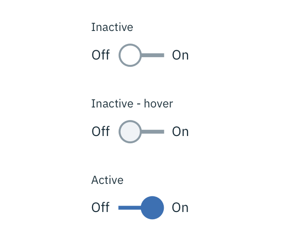
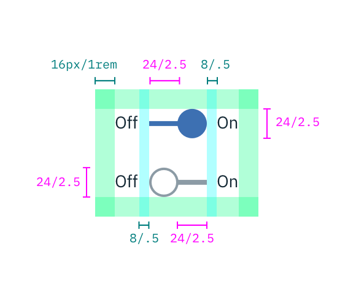

## Color

| ATTRIBUTE                 | SCSS     | HEX      |
|-----------------------|----------|----------|
| Inactive: fill        | $ui-01   | #ffffff  |
| Inactive: border      | $ui-05   | #8c9ba5  |
| Inactive: hover       | $ui-03   | #f0f3f6  |
| Active: fill          | $brand-01| #3d70b2  |
| Label                 | $text-01 | #152935  |

---
***
> 

_Examples of inactive, inactive hover, and active states for a Toggle_

## Typography

Toggle labels should be set in sentence case, with only the first word in a phrase and any proper nouns capitalized, and no more than three words.

| PROPERTY | FONT-SIZE (px/rem)    | FONT-WEIGHT |
|----------|-----------------|--------------|
| Label    | 14 / 0.875 | Normal / 400 |

## Structure

| PROPERTY          | PX | REM   |
|-------------------|----|-------|
| Height & width    | 24 | 1.5   |
| Circle border     | 2  | 0.125 |
| Slider line width      | 24 | 1.5   |
| Spacing: external | 16 | 1     |
| Spacing: internal | 8  | 0.5   |

---
***
> 

_Structure and spacing measurements for Toggle | px / rem_
