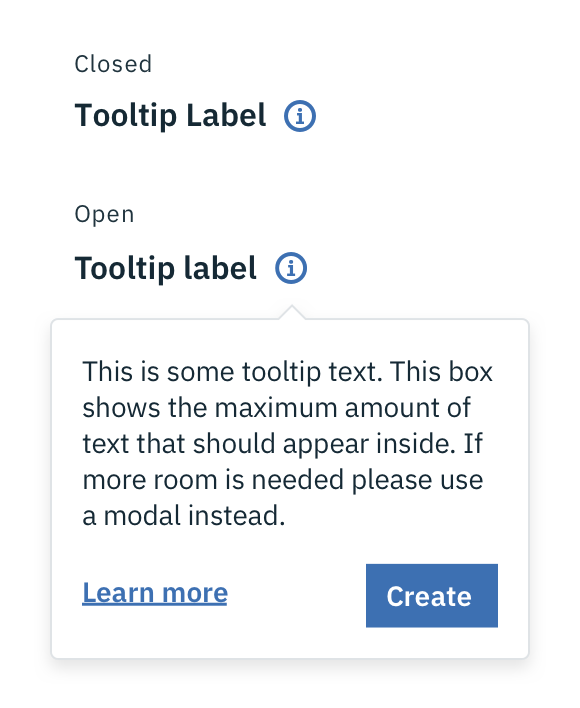
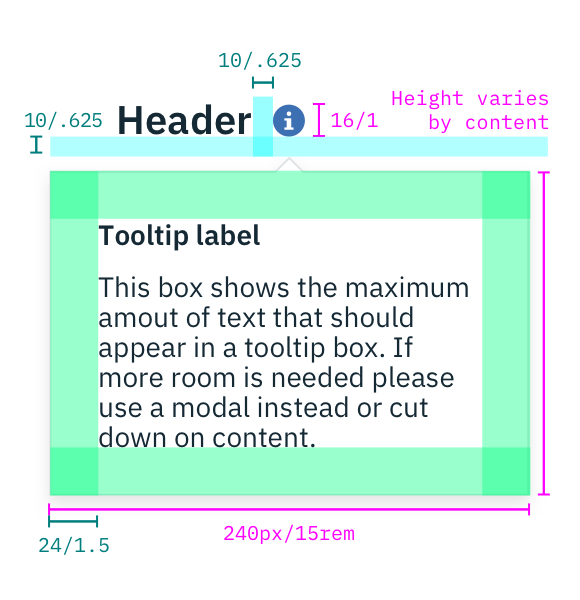
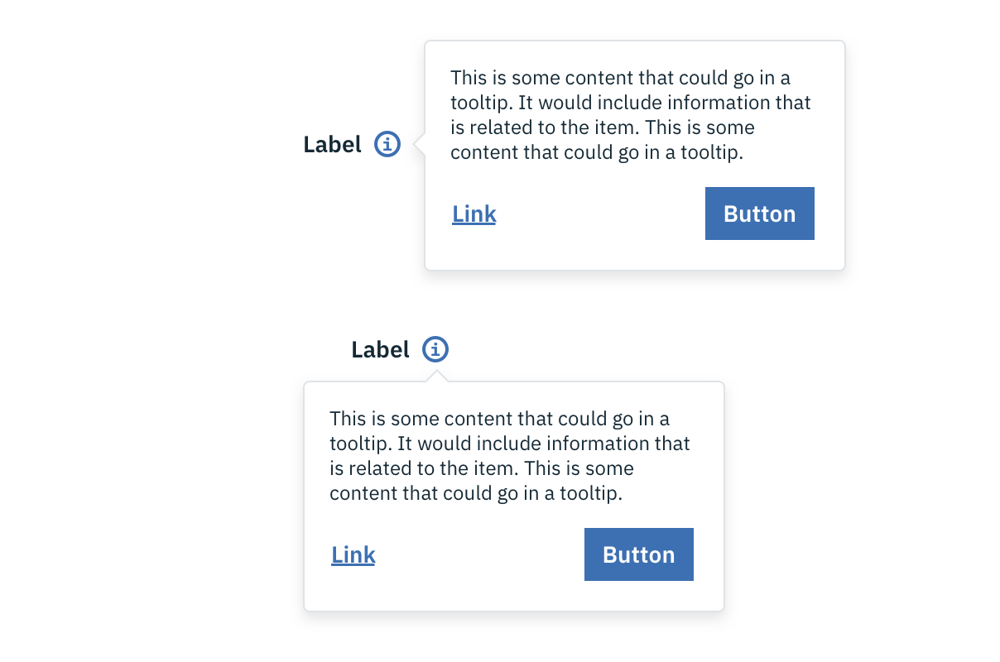

## Color

| ATTRIBUTE              | SCSS      | HEX       |
|--------------------|-----------|-----------|
| Icon               | $brand-01 | #3d70b2   |
| Icon: hover        | $brand-02 | #5596e6   |
| Text               | $text-01  | #152935   |
| Tooltip background | $ui-01    | #ffffff   |
| Tooltip border     | $ui-04    | #dfe3e6   |

---
***
>  

_Example of closed and open states for a Tooltip_

## Typography

Tooltip labels and text should be set in sentence case.

| PROPERTY | FONT-SIZE (px/rem)     | FONT-WEIGHT  |
|----------|-----------------|--------------|
| Header   | 16 / 1     | Bold / 700   |
| Label    | 14 / 0.875 | Bold / 700   |
| Text     | 14 / 0.875 | Normal / 400 |

## Layer

| LAYER      | ELEVATION     | BOX-SHADOW      |
|------------|----------|----------|
| Overlay    | 8        | `0 4px 8px 0 rgba(0,0,0,0.10);`  |

## Structure

| PROPERTY                | PX  | REM   |
|-------------------------|-----|-------|
| Tooltip: width          | 240 | 15    |
| Tooltip: height         | Varies based on content | - |
| Icon: width & height    | 16  | 1     |
| Spacing: label & icon   | 10  | 0.625 |
| Spacing: icon & Tooltip | 10  | 0.625 |
| Spacing: internal       | 24  | 1.5   |

---
***
>  

_Structure and spacing measurements for a Tooltip | px / rem_

### Placement

Tooltips should always be placed below the Tooltip icon unless it is within the height of the Tooltip box plus 16px / 1em of the bottom of the page. In that instance, the Tooltip should appear to the right of the Tooltip icon. On mobile, Tooltips can only appear below the Tooltip icon.

_Placement examples for a Tooltip_
