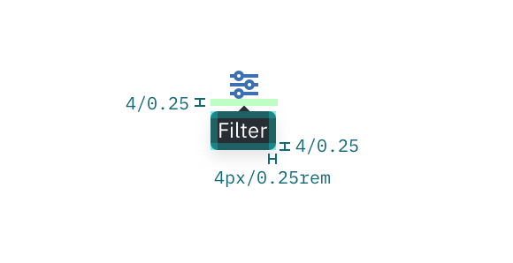
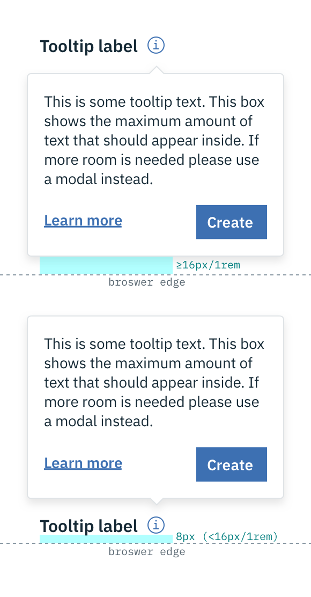

## Color
| COLOR              | SCSS      | HEX       |
|--------------------|-----------|-----------|
| Icon               | $brand-01 | #3d70b2   |
| Interactive text    | $text-01  | #152935   |
| Interactive background | $ui-01    | #ffffff   |
| Interactive border     | $ui-03    | #dfe3e6   |
| Definition & Icon text    | $ui-01  | #ffffff   |
| Definition & Icon background | $inverse-02   | #272d33   |

_Example of closed and open states for a Tooltip_

## Typography
Tooltip labels and text should be set in sentence case.

| PROPERTY | FONT-SIZE (px/rem)      | FONT-WEIGHT  |
|----------|-----------------|--------------|
| Label    | 16 / 1 | Semi-Bold / 600   |
| Interactive text     | 14 / 0.875 | Normal / 400 |
| Definition & Icon text     | 12 / 0.75 | Normal / 400 |

## Layer
| LAYER      | ELEVATION     | BOX-SHADOW      |
|------------|----------|----------|
| Overlay    | 8        | `0 4px 8px 0 rgba(0,0,0,0.10);`  |

## Structure
| PROPERTY                | PX  | REM   |
|-------------------------|-----|-------|
| Tooltip: height         | Varies based on content | |
| Interactive: width      | 240 | 15    |
| Definition: width       | 176 | 11    |
| Icon: width             | Varies based on content | |
| Tooltip icon: width & height | 16  | 1     |
| Spacing: label & icon   | 8  | 0.5 |
| Spacing: icon & Interactive aTooltip | 8  | 0.5 |
| Spacing: dotted line & Definition Tooltip | 4  | 0.25 |
| Spacing: icon & Icon Tooltip | 2  | 0.125 |
| Interactive: internal spacing | 16  | 1   |
| Definition: internal spacing | 8  | 0.5   |
| Icon: internal spacing | 4  | 0.25   |

_Structure and spacing measurements for an Interactive Tooltip | px / rem_

_Structure and spacing measurements for a Definition Tooltip | px / rem_

_Structure and spacing measurements for an Icon Tooltip | px / rem_

### Placement
Tooltips should be placed below the Tooltip icon unless it is within the height of the Tooltip box plus 16px / 1rem of the bottom of the page. In that instance, the Tooltip should appear above the icon or defined word. On mobile, Tooltips can only appear below the Tooltip icon.

_Placement examples for a Tooltip_
