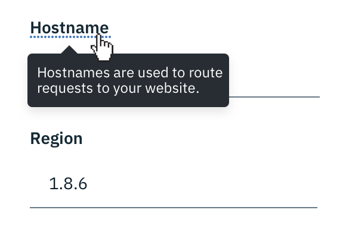
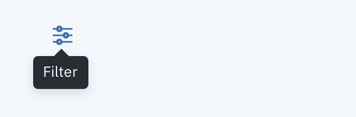
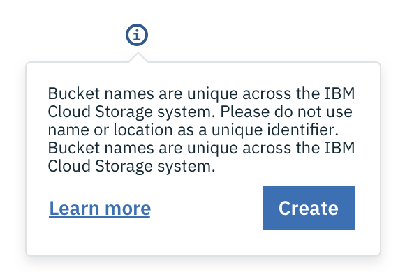

## Usage
| Type               | Purpose                                        |
|--------------------|------------------------------------------------|
| Definition Tooltip | Describes the meaning of a term or icon button. It appears on hover and is limited to read-only text.                                                                                                                                                                                                       |
| Interactive Tooltip|  Provides additional information relevant to the context on `click.` It supports more flexible elements including Buttons and Links.                                                                                                                                                                                                                              |

### Definition Tooltip
The primary purpose of a Definition Tooltip is to provide additional help or context to an item. Their primary use case is for defining terms, such as within a Form where the label needs an additional definition. They can also be used to define an icon button. We recommend Definition Tooltips contain read-only text that is kept to a minimum. These Tooltips appear on `hover`. If you need to include other components within a Tooltip, refer to the Interactive Tooltip below.

---
***
> 

_Definition Tooltip used to define a Form label_

---
***
> 

_Definition Tooltip used to define an icon_

### Interactive Tooltip
Interactive Tooltips can contain text and other interactive elements such as a Button or a Link. They should only appear on mouse `click`, due to the fact that there are multiple click targets within the Tooltip.  

---
***
> 

_Example of an Interactive Tooltip_
