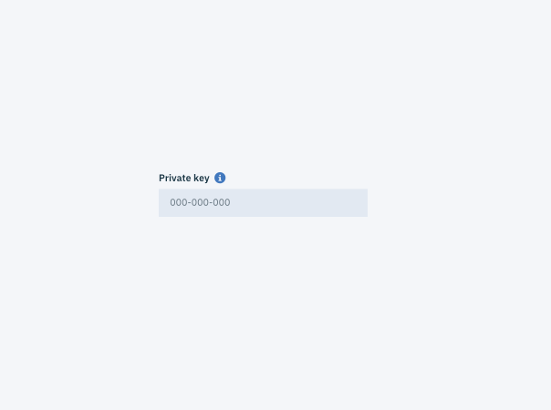

## Content

### Length

Due to its disruptive nature, Tooltip content should be kept to an absolute minimum. For larger sets of content or data, consider using a [Passive Modal.](/components/modal) The Modal will be triggered when the user clicks the information icon, as opposed to the regular `:hover` interaction of a generic Tooltip. 

_Passive Modal triggered on click_

### Interactive elements

The primary purpose of a Tooltip is to provide additional help or context to an item. Therefore, they should contain read-only text. The use of interactive elements, such as Buttons or Links, is discouraged.
