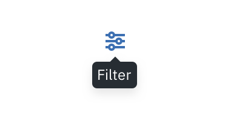

## Usage
| Type               | Purpose                                        |
|--------------------|------------------------------------------------|
| Icon Tooltip | Used for defining (naming?) icons. Content should be kept to one to two words.                                                                                                                                                                                                       |
| Definition Tooltip | Used for defining terms. Content is kept to a minimum.                                                                                                                                                                                                       |
| Interactive Tooltip| Used for more complex content types, and allows interactive elements such as Buttons or Links.                                                                                                                                                                                                                              |

### Icon Tooltip
An Icon Tooltip is used to define an interactive (button?) icon.  The tooltip content should only contain the name of the icon or action it performs. Icon Tooltips appear on `hover` and `focus`.

_Definition tooltip used to define a Form label_

### Definition Tooltip
The primary purpose of a Definition Tooltip is to provide additional help or context to an item. Therefore, they should contain read-only text that is kept to a minimum. The use of interactive elements, such as Buttons or Links, is discouraged. Definition Tooltips appear on `hover` and `focus`.

_Definition tooltip used to define a Form label_

### Interactive Tooltip
Interactive Tooltips can contain text and other interactive elements such as a Button or a Link. They appear on mouse `click` and are persistent until intentionally dismissed by clicking outside of the tooltip.

_Example of an Interactive tooltip_
