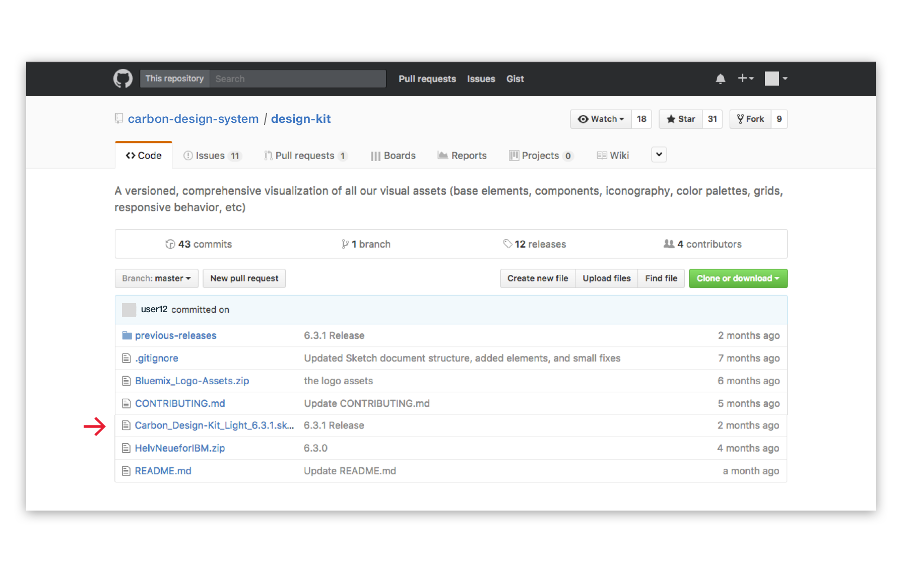
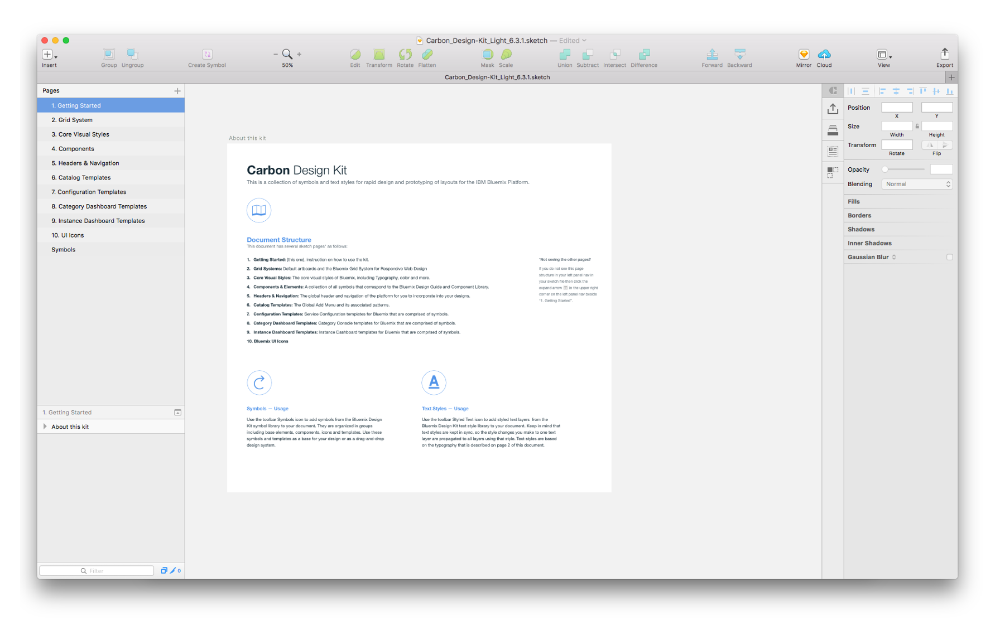
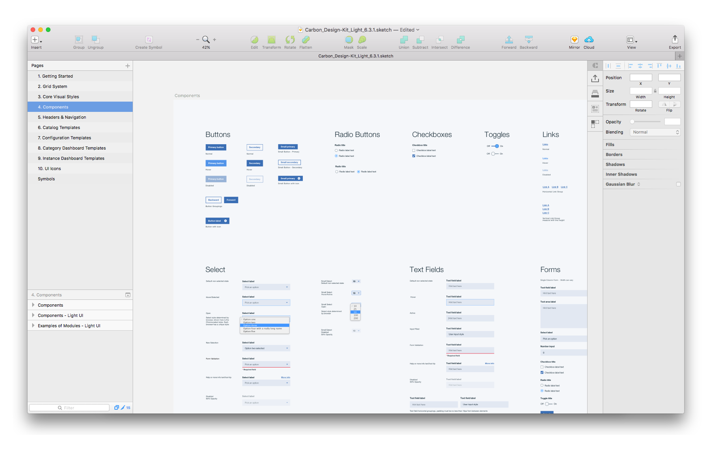

**The _Carbon Design Kit_ is a living, breathing document that contains all of our visual assets (components, iconography, color palettes, grids, etc).**

## Setup

### 1. Download the Kit

Go to the <a href="https://github.com/carbon-design-system/carbon-design-kit" target=blank> Carbon Design Kit</a> repo and click on the latest version of the Design Kit. Click the “View Raw” link to begin downloading the kit.

### 2. Open the Design Kit in Sketch

#### Why Sketch?

<a href="https://www.sketchapp.com/" target=blank>Sketch</a> is the industry standard design tool for UI design.

You can purchase a lifetime license for $99. If you donʼt have a license for Sketch, you may sign up for a 30-day free trial. Sketch is easy to learn, and they offer many <a href="https://leveluptutorials.com/tutorials/sketch-3-tutorials" target=blank>tutorials</a> for further learning.

### 3. Using the Design Kit

The Design Kit contains core visual styles, components, color swatches, iconography, and templates. It also has a collection of symbols and text styles for rapid design and layout prototyping. Each is designated its own page, which may be accessed via the left side panel.

## Releases

The Carbon Design System team often makes improvements to the Design Kit. We track all release updates in our <a href="https://github.com/carbon-design-system/carbon-design-kit/tree/master/previous-releases" target=blank>change log</a>, so check back frequently!
