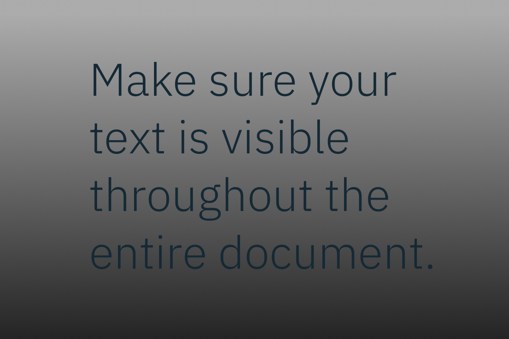
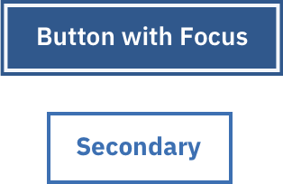
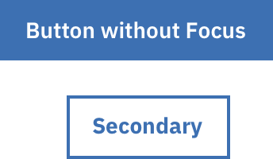

## Using Carbon for accessibility

**As Designers, we should ensure that elements in the interface are perceivable and operable. Accessibility standards are integrated into the Carbon components; using them appropriately is key!**

## Typography

**Use appropriate kerning and leading to separate text enough to be easily read**

Kerning and leading that is too tight or too spaced out makes information difficult to read.

  

    
    
  

  

    
    
  

**Avoid words in all capital letters and avoid excessive use of italic fonts**

Words in all capital letters and italic fonts are generally harder to read. They also pose an extra challenge to those with dyslexia.

  

    
    
  

  

    
    
  

## Text contrast

**For large text, the minimum contrast ratio must be 3:1. For anything smaller or lighter than large text, the minimum contrast ratio is 4.5:1**

Large text = either 18pt regular weight or 14pt bold weight and above.

  

    
    
  

  

    
    
  

**For anything smaller or lighter than large text, the minimum contrast ratio must be 4.5:1**

  

    
    
  

  

    
    
  

**Watch out for text against non-static backgrounds**

There are times that text is rendered on a gradient background. You need to make sure the text color contrast meets standards for the entire gradient. This is especially important for parallax applications or animations where text or backgrounds are moving independently of each other.

  

    
    
  

  

    
    
  

## Iconography

**Glyphs should be at least 24 x 24 pixels and icons should be at least 32 x 32 pixels large**

Icons should be large enough to easily see. This helps people with moderately low vision or color blindness more easily see icons in the user interface.
 
 

**Clickable/touch-target areas should be at least 44 x 44 pixels**

Clickable/touch-target area should be large enough, especially for mobile.

  

    
    
  

  

    
    
  

## Link contrast

**Underline or provide enough color contrast (a minimum ratio of 3:1) for links**

Using colored backgrounds under links that have surrounding text can be a challenge.If you don’t use white or black backgrounds, you may find it easier to simply underline your links.

  

    
    
  

  

    
    
  

## Color

**Don't rely on color alone to convey meaning**

People who are color blind, visually impaired, or have deteriorating vision can have difficulty perceiving color differences. Do not use color as the only visual means of: conveying information, indicating an action, prompting the user for a response, or distinguishing a visual element from another.

  

    
    
  

  

    
    
  

## Visible states

**Provide highly visible focus and selection indicators**

Default browser behavior is that focus moves to an element when it is clicked with a mouse. Keep this in mind when designing a focus state. It is not only keyboard-only users who will see the focus treatment. Additionally, it must be obvious what is the currently selected element versus which element has the keyboard focus. Otherwise, the cursor focus may be hidden and the user may get lost.

  

    
    
  

  

    
    
  

