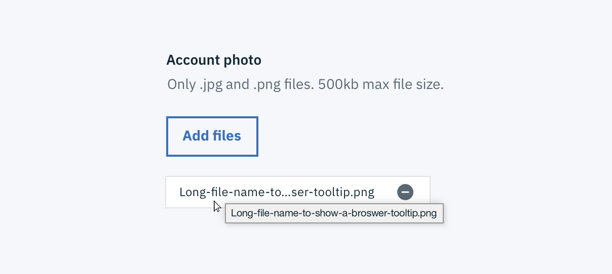
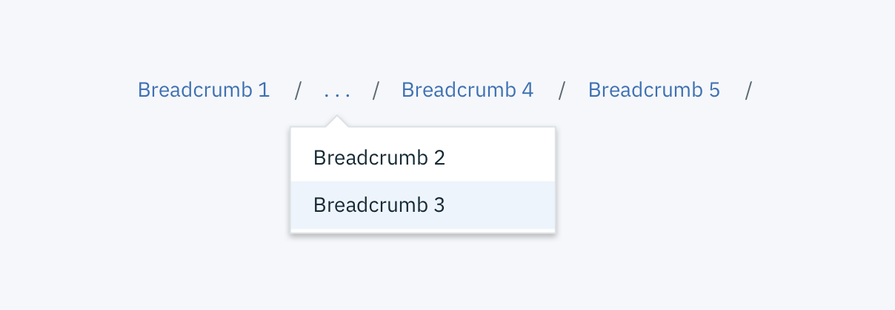

Overflow content is text, such as a paragraph or a text string, that exceeds a desired space. It also applies to a series of components that surpass a given space. Overflow content is typically reduced to fit a space or reduce repetition. Truncation and ‘Show more’ Buttons are two ways to indicate that overflow content is continued elsewhere or below the fold.

## Truncation
Truncation is typically used for static text or Links. Truncated items are represented by an ellipse `...` and should represent three or more tuncated characters in a text string. There must be atleast four characters of non-ellipsed content in a truncated string. Truncated items always include a browser tooltip on hover to show the entire string, name, or phrase that the ellipses is representing. The only time a browser tooltip does not need to be used is at the end of a truncated paragraph.    

_Example of a browser tooltip being used for truncation._

_Example of end-line truncation for a paragraph._

Good use cases for truncation include:

- Breadcrumbs
- Pagination
- Long URL links
- Paragraph of text (i.e. a description paragraph)
- Truncation of a long item name (user or platform generated)

Truncation should **not** be used on page headers, titles, labels, error messages, validation messages, Notifications, menu items, or Tabs.

There are three types of truncation: front-line, midline, and end-line. *(Use examples above in the the example images below)*

| Type of truncation   | Definition  | Not Truncated  |  Truncated |   
|---|---|---|---|
| **Front-line**  | Used at the beginning of a text string to indicate the text is continued from a previous location.  | `123456789`  |  `...56789` |
| **Midline**  | Used when several text strings have different begginings and/or endings but the exact same middle characters. Can also be used to shorten a phrase or text string when the end of a string cannot be truncated by an ellipses.    | `123400005678` `987600004321`  | 	`1234...5678` `9876...4321`  |   
| **End-line**  | Used at the end of a character string or paragraph to indicate that there is more content in another location, to show that the pattern in a sequence continues, or to shorten a long text string.    | `123456789`  | `12345...`  |   

An ellipse (…) on its own may also represent condensed content. This type of truncation requires an overflow menu on hover instead of a browser tooltip. See [Breadcrumb](link) or [Pagination](link) for additional examples of this.  

_Example of a truncated Breadcrumb utilizing an ellipse with an Overflow Menu._

### 'Show more' Buttons
The ‘Show more’ Button is used when there is a significant amount of overflow content. Implementing a ‘Show more’ Button gives a user the ability to see the content in more digestible chunks as opposed to all at once. A ‘Show more’ Button is used in place of scrolling, gradients, or fades as they are more prominent and actionable. If needed a 'Show less' can be used to again hide the content the user opened. ‘Show more’ can also be presented as ‘Load more’ in cases where performance is a concern. See the [Loading](link) section for additional details.

_Example of the 'Show more' Button in context._

<!--## Code??

This is where we would discuss class used for truncation and show more buttons?-->
