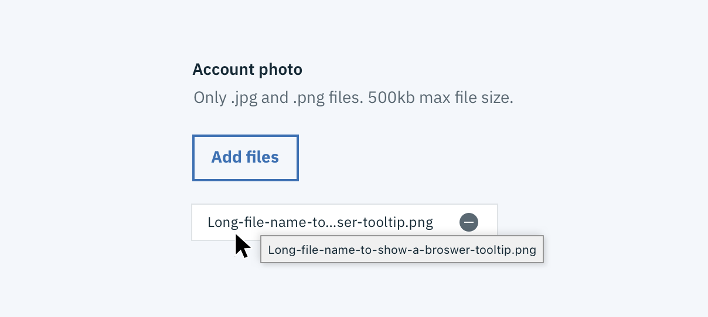

## Cursors

Cursors are used to indicate to the user the action they can take. Below is a chart of common cursors that are built into the Carbon components. Hover over a row to see each particular cursor in action.

For a more comprehensive list of cursors checkout [mozilla](https://developer.mozilla.org/en-US/docs/Web/CSS/cursor).

### Browser Tooltip

A browser tooltip is generated by the browser and appears on extended hover. The visual appearance varies from browser to browser however the content remains consistent. These tooltips help with accessibility as they add an extra layer of clarity and specification to an element. A browser tooltip is enacted when a title attribute has been added to an html element. It would look something like `title=“tooltip browser content”`

A good use case for a browser tooltip is front-end or midline truncation. The user hovers over the truncated string of text and a browser tooltip appears showing the full string.

