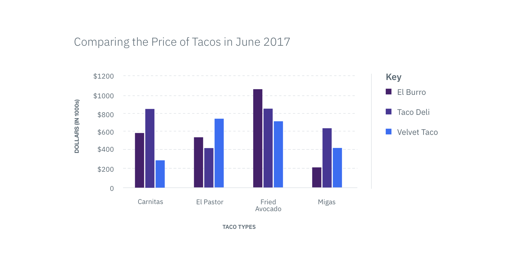

**March 9, 2018**

## Style

### Systematic spacing

We have tokenized our spacing and now offer two systemized scales. The Spacing Scale defines space within a component while the Layout Scale is used to help position elements on a page. Check out the new [Spacing](style/spacing) section to learn more about these scales and read the rest of the spacing guidelines.

## Design Kit

### Sketch Libraries

We have recorded a [Carbon Design Kit with Sketch Libraries Tutorial](https://www.youtube.com/watch?v=Tm-s0Hcbwck&list=PL4BR_VlGD31aVhe1ScKk9UOhbi8YOL0dF) over on our YouTube channel. It goes over how to download the Carbon Sketch Kit, import a Sketch Library, as well as how to get and accept library updates/notifications. It also gives a brief overview of how the Library is organized and how to use the overrides panel and library symbols.

**February 23, 2018**

## Design Kit

### Sketch Libraries
The Carbon Design Kit now includes Sketch Libraries, a better way to share and version symbols across Sketch files. Check out our [Sketch Libraries wiki](https://github.com/carbon-design-system/carbon-design-kit/wiki/Sketch-Libraries-Overview) to get a quick tutorial on libraries.

_Sketch Libraries in the Carbon Design Kit_

### Sketch Plugins
With the latest release of the Design Kit, we've included the [Sketch Palettes](https://github.com/andrewfiorillo/sketch-palettes) plugin, which allows you to load in pre-saved palettes for Sketch. You can import Carbon's four color palettes (Carbon default theme, Data Vis primary, Data vis secondary, and Data Vis tertiary) into your working Sketch document.

_Sketch Palettes plugin_

There's also a variety of other [plugins](https://github.com/carbon-design-system/carbon-design-kit/wiki/Suggested-Sketch-Plugins) we recommend to help improve your workflow using Sketch.

Download the latest Kit today!

***
<a href="https://github.com/carbon-design-system/carbon-design-kit" target="_blank">Carbon Design Kit</a>

## Carbon Sessions
Interested in getting some 1:1 time with the Carbon team? Carbon Sessions is a chance for anyone using the Carbon Design System to ask questions and get feedback. Sessions happen very Wednesday morning (Central Standard Time). Time slots are around 10 minutes, but feel free to book more than one if you need additional time.

Sign up for a [Carbon Sessions time slot](https://github.com/carbon-design-system/design-system-website/wiki/Carbon-Sessions) if you're interested in chatting further!

**February 9, 2018**
## Components
### Dropdown
We're excited to bring some added functionality that enhances our [Dropdown](/components/dropdown) component. Filtering, Multi-select, and Inline Dropdown are new additions to our basic Dropdown component.

**Note: This component is currently only available in [React](http://react.carbondesignsystem.com/?selectedKind=ComboBox&selectedStory=default&full=0&addons=1&stories=1&panelRight=0&addonPanel=storybook%2Factions%2Factions-panel).**

_Example of Multi-Select Dropdown_

### Small Toggle
Small Toggle is a style variation of our traditional [Toggle](/components/toggle) component. It's more compact in size, which allows them to be used in Data Tables or inline with Form elements.

---
***
> 
_Example of Small Toggle_

### Data Vis: Bar Graph
Bar Graph is the newest addition to our Data Visualization collection. It comes in two variations: Bar Graph and Grouped Bar Graph. You can use this component to represent quantitative information, such as comparing the taco sales between Austin taco shops in the month of June.

Read more about the usage of [Bar Graph](http://carbondesignsystem.com/data-vis/bar-graph/usage), or check out our [CodePen](https://codepen.io/team/carbon/pen/OzBKKN) to view the live demo.

### Data Vis: Tooltip
We have created several Data Visualization Tooltip variations to show the value for a specific data point or increment range. Tooltips appear on hover above or below a data representation, depending on the use case.

Read more about the usage of [Data Vis Tooltips](/data-vis/tooltip/usage), or check out our [CodePen](https://codepen.io/team/carbon/pen/rJWymp) to view the live demo.

_Small Tooltip used within a Bar Graph_
